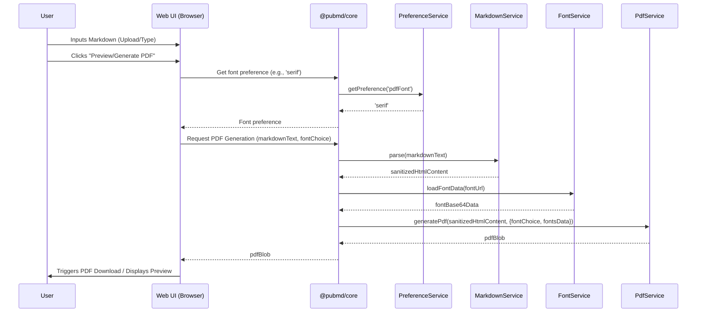
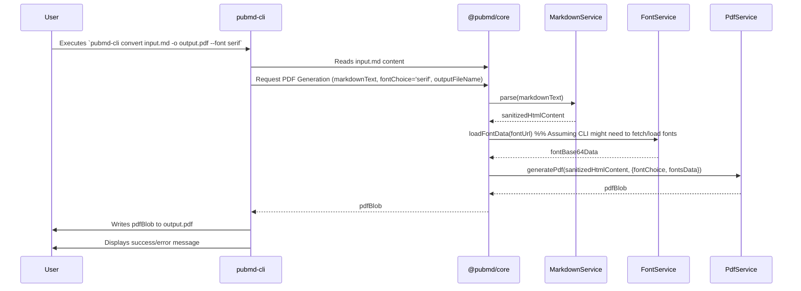
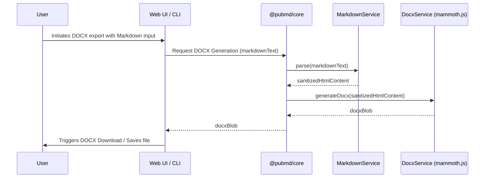

# Solution Architecture Design Specification

**Project:** Markdown to PDF Converter (pubmd-atomised)
**Version:** 1.0
**Date:** 2025-05-18

## 1. Introduction

### 1.1 Project Overview

This document outlines the solution architecture for the "Markdown to PDF Converter" project, also known as "pubmd-atomised." The project aims to refactor an existing HTML-based Markdown to PDF conversion tool into a more robust, maintainable, and extensible solution. Key goals include creating a shared core logic library, developing a Command-Line Interface (CLI), and improving the overall development stack and practices. The original single-HTML design goal remains for a web version, alongside a new shell-based package.

This specification is based on information gathered from existing project documentation, including:
*   [`README.md`](../../README.md)
*   [`documentation/00_Planning_And_Initiation/nextstepsforthisproject.md`](../00_Planning_And_Initiation/nextstepsforthisproject.md)
*   [`documentation/01_Requirements/.Business_Requirements.md`](../01_Requirements/.Business_Requirements.md)
*   [`documentation/02_Architecture/.Architectural_Decisions_Log.md`](.Architectural_Decisions_Log.md)
*   [`documentation/02_Architecture/Core_Logic_Componentization_Strategy.md`](Core_Logic_Componentization_Strategy.md)
*   [`documentation/02_Architecture/solution_options_analysis.md`](solution_options_analysis.md)
*   [`documentation/03_Implementation/Implementation_Plan.md`](../03_Implementation/Implementation_Plan.md)

### 1.2 Goals and Objectives

The primary goals of this architectural evolution are:

*   **Componentization:** Refactor core PDF generation logic into reusable software components.
*   **Dual Interface:** Offer users a web-based User Interface (UI) and a Command-Line Interface (CLI).
*   **Code Reusability:** Maximize code sharing between the web UI and CLI versions through a common core library.
*   **Maintainability:** Improve code organization, testability, and ease of maintenance by adopting TypeScript and modern development practices.
*   **Extensibility:** Lay a foundation for future enhancements, such as .docx export.
*   **CLI Accessibility:** Ensure the CLI version is easily installable and usable in a bash shell environment.

### 1.3 Scope

The scope of this architecture includes:

*   A core library (`@pubmd/core`) containing shared logic for Markdown parsing, HTML sanitization, font handling, and PDF/DOCX generation.
*   The existing web UI, refactored to use `@pubmd/core`.
*   A new CLI application (`pubmd-cli`) for terminal-based conversions.
*   Initial support for Markdown to PDF conversion.
*   Proof-of-concept and planned integration for Markdown to .docx export.

### 1.4 Target Users

*   **Technical Users (e.g., Developers):** Require a CLI for automation, scripting, and integration into workflows.
*   **Non-Technical Users:** Require an easy-to-use web UI for straightforward, ad-hoc conversions.

## 2. Architectural Drivers

### 2.1 Business Requirements

Key business requirements driving the architecture (summarized from [`documentation/01_Requirements/.Business_Requirements.md`](../01_Requirements/.Business_Requirements.md)):

*   Provide both Web UI and CLI interfaces.
*   CLI must be installable via a standard method for bash shell use.
*   Web UI should remain easy to use for ad-hoc conversions.
*   Core logic must be refactored into reusable components.
*   Both UI and CLI should produce PDFs with corrected list rendering and heading-based navigation.

### 2.2 Technical Constraints & Considerations

*   **Technology Preference:** JavaScript/TypeScript ecosystem.
*   **Code Reusability:** A central design principle.
*   **Monorepo Structure:** Adopt `pnpm` workspace for managing packages.
*   **Existing Libraries:** Leverage existing libraries like `marked.js`, `jsPDF`, `html2canvas`, `CodeMirror`, and `DOMPurify`.
*   **Open Source Tooling:** Preference for open-source development tools.
*   **Phased Development:** Initial 5-week sprint for architectural refactoring and CLI foundation, followed by feature enhancements.

## 3. System Overview

The system will consist of three main parts: the shared core library (`@pubmd/core`), the Web UI application, and the CLI application. Both the Web UI and CLI will consume services provided by `@pubmd/core`.

### 3.1 High-Level Architecture Diagram

```mermaid
graph TD
    subgraph User_Interfaces
        WebUI[Web UI (Browser)]
        CLI[CLI (Terminal)]
    end

    subgraph Core_Logic
        CoreLib["@pubmd/core (TypeScript Library)"]
    end

    WebUI -->|Uses| CoreLib
    CLI -->|Uses| CoreLib

    style CoreLib fill:#f9f,stroke:#333,stroke-width:2px
```

## 4. Component Architecture

### 4.1 `@pubmd/core` Package

(Based on [`documentation/02_Architecture/Core_Logic_Componentization_Strategy.md`](Core_Logic_Componentization_Strategy.md) and [`documentation/02_Architecture/.Architectural_Decisions_Log.md`](.Architectural_Decisions_Log.md))

#### 4.1.1 Overview

`@pubmd/core` will be a TypeScript library within the `pnpm` workspace monorepo. It encapsulates all shared logic for Markdown processing, document generation (PDF, .docx), font management, and preference handling. It will expose well-defined, typed public interfaces for consumption by the Web UI and CLI.

#### 4.1.2 Services

The following services are proposed for `@pubmd/core`:

*   **`PreferenceService`**
    *   **Responsibilities:** Manages storage and retrieval of user preferences (e.g., dark mode, font choice) using `localStorage` or a similar mechanism.
    *   **Proposed API:**
        ```typescript
        interface IPreferenceService {
          getPreference(name: string): string | null;
          setPreference(name: string, value: string): void;
        }
        ```

*   **`FontService`**
    *   **Responsibilities:** Handles fetching, processing, and preparing font data for web display and PDF embedding.
    *   **Proposed API:**
        ```typescript
        interface FontData {
          arrayBuffer: ArrayBuffer;
          base64: string;
        }
        interface WebFontConfig {
          name: string;
          base64Data: string;
        }
        interface PdfFontConfig {
          vfsName: string;
          base64Data: string;
          pdfFontName: string;
          style: string;
        }
        interface IFontService {
          loadFontData(url: string): Promise<FontData | null>;
          injectFontFacesForWeb(fonts: WebFontConfig[]): void;
          addFontsToPdf(pdfInstance: jsPDF, fonts: PdfFontConfig[]): void;
        }
        ```

*   **`MarkdownService`**
    *   **Responsibilities:** Parses Markdown to HTML, handles Mermaid diagram rendering, and sanitizes HTML output using DOMPurify.
    *   **Proposed API:**
        ```typescript
        interface MarkdownParseOptions {
          mermaidTheme?: string;
          mermaidSecurityLevel?: 'strict' | 'loose' | 'antiscript' | 'sandbox';
          sanitizeHtml?: boolean;
          gfm?: boolean;
          breaks?: boolean;
          headerIds?: boolean;
        }
        interface IMarkdownService {
          parse(markdownText: string, options?: MarkdownParseOptions): Promise<string>;
        }
        ```

*   **`PdfService`**
    *   **Responsibilities:** Generates PDF documents from HTML content using `jsPDF` and `html2canvas`, including styling and layout adjustments.
    *   **Proposed API:**
        ```typescript
        interface PdfFontDetails {
          nameVFS: string;
          base64Data: string;
          pdfFontName: string;
          style: string;
        }
        interface PdfGenerationOptions {
          fileName?: string;
          fontChoice: 'sans' | 'serif';
          fonts: {
              sans: PdfFontDetails;
              serif: PdfFontDetails;
          };
          jsPDFInstance?: jsPDF;
          margins?: [number, number, number, number] | number;
          pageSize?: string;
          orientation?: 'portrait' | 'landscape';
          contentWidthPx?: number;
          dpi?: number;
        }
        interface IPdfService {
          generatePdf(htmlContent: string, options: PdfGenerationOptions): Promise<Blob>;
        }
        ```
*   **(Future) `DocxService`** (Integrating `mammoth.js`)
    *   **Responsibilities:** Converts HTML content to .docx format.
    *   **Proposed API (Conceptual):**
        ```typescript
        interface DocxGenerationOptions {
          // Options specific to mammoth or docx generation
        }
        interface IDocxService {
          generateDocx(htmlContent: string, options?: DocxGenerationOptions): Promise<Blob>; // Or ArrayBuffer
        }
        ```

#### 4.1.3 `@pubmd/core` Internal Interaction Diagram

(Adapted from [`documentation/02_Architecture/Core_Logic_Componentization_Strategy.md`](Core_Logic_Componentization_Strategy.md))
```mermaid
graph TD
    subgraph Core_Package [@pubmd/core]
        P[PreferenceService]
        FS[FontService]
        MS[MarkdownService]
        PS[PdfService]
        DS[DocxService (Future)]
    end

    MS -->|HTML for| PS
    MS -->|HTML for| DS
    FS -->|Fonts for| PS

    %% External consumers (WebUI, CLI) will call these services directly.
    %% For example, a conversion operation would typically involve:
    %% 1. MarkdownService.parse()
    %% 2. FontService.loadFontData() (if not already loaded)
    %% 3. PdfService.generatePdf() OR DocxService.generateDocx()
```

### 4.2 Web UI Application

#### 4.2.1 Overview

The existing Web UI is an HTML, CSS, and JavaScript application ([`src/web/index.html`](../../src/web/index.html), [`src/web/script.js`](../../src/web/script.js)). It provides a Markdown editor (CodeMirror), file upload, live preview, and PDF generation capabilities.

#### 4.2.2 Interaction with `@pubmd/core`

The Web UI's [`script.js`](../../src/web/script.js) will be refactored to:
*   Import and instantiate services from `@pubmd/core`.
*   Delegate tasks like Markdown parsing, font loading, preference management, and PDF generation to the core services.
*   Handle the results (e.g., display parsed HTML, trigger PDF download from Blob).

#### 4.2.3 UI-Specific Logic

The following logic will remain primarily within the Web UI's presentation layer:
*   DOM element selection and direct manipulation.
*   CodeMirror editor setup, theme switching, and direct interactions.
*   Event listeners for UI controls.
*   Management of the preview modal's state and content population (using data from core services).
*   Fetching `default.md` for initial editor content.
*   UI state updates and feedback messages.

### 4.3 Command-Line Interface (`pubmd-cli`)

#### 4.3.1 Overview

`pubmd-cli` will be a new application built with Node.js and TypeScript, using `commander.js` for command-line argument parsing. It will provide terminal-based access to the Markdown conversion functionalities.

#### 4.3.2 Interaction with `@pubmd/core`

The CLI will:
*   Import and utilize services from `@pubmd/core` for its operations.
*   Pass command-line arguments as options to the core services.
*   Handle file input/output operations.
*   Display progress, status, and error messages to the terminal.

#### 4.3.3 Packaging and Distribution

(Based on [`documentation/02_Architecture/.Architectural_Decisions_Log.md`](.Architectural_Decisions_Log.md))
*   **npm Package:** Published to npm for installation via `npm i -g pubmd-cli`.
*   **Standalone Binaries:** Pre-built binaries for major OS (Linux, macOS, Windows) generated using `pkg`.
*   **Docker Image (Optional):** A Dockerfile will be provided for containerized builds/distribution, primarily for CI/CD and advanced users.

## 5. Technology Stack

(Consolidated from [`README.md`](../../README.md) and [`documentation/02_Architecture/.Architectural_Decisions_Log.md`](.Architectural_Decisions_Log.md))

*   **Core Logic (`@pubmd/core`):**
    *   Language: TypeScript
    *   Markdown Parsing: `marked.js`
    *   HTML to Canvas: `html2canvas`
    *   PDF Generation: `jsPDF`
    *   Diagram Rendering: `Mermaid`
    *   HTML Sanitization: `DOMPurify`
*   **Web UI:**
    *   Structure: HTML5
    *   Styling: CSS3
    *   Scripting: JavaScript (refactoring to use `@pubmd/core` written in TypeScript)
    *   Markdown Editor: `CodeMirror`
*   **CLI (`pubmd-cli`):**
    *   Runtime: Node.js
    *   Language: TypeScript
    *   Argument Parsing: `commander.js`
*   **.docx Export:**
    *   Library: `mammoth.js` (HTML to DOCX)
*   **Development & Build Tooling:**
    *   Package Manager & Monorepo: `pnpm` (workspaces)
    *   Testing (Unit): Vitest (or Jest with `ts-jest`)
    *   Testing (Integration - Web): Playwright (headless Chromium PDF snapshot diff)
    *   Testing (CLI): `zx` / shell scripts in CI
    *   Linting & Formatting: ESLint, Prettier
    *   CLI Binary Packaging: `pkg`
    *   Containerization (Optional): Docker
    *   CI/CD: GitHub Actions
    *   Dependency Updates: Renovate Bot
    *   Versioning & Publishing: `semantic-release`
*   **Fonts:**
    *   Source: DejaVu Fonts (CDN) for PDF character support.

## 6. Data Flow Diagrams

### 6.1 Markdown to PDF Conversion (Web UI)



### 6.2 Markdown to PDF Conversion (CLI)



### 6.3 Markdown to DOCX Conversion (Conceptual)



## 7. Cross-Cutting Concerns

(Based on [`documentation/02_Architecture/.Architectural_Decisions_Log.md`](.Architectural_Decisions_Log.md) and [`documentation/02_Architecture/solution_options_analysis.md`](solution_options_analysis.md))

### 7.1 Testing Strategy

*   **Unit Testing (`@pubmd/core`, CLI modules):** Vitest (or Jest) + `ts-jest`. Target ≥ 90% coverage for core modules.
*   **Integration Testing (Web UI):** Playwright for headless Chromium PDF snapshot diffing, covering key user flows.
*   **CLI Testing:** `zx` or shell scripts in CI to assert exit codes, file outputs, and behavior for all flags.
*   **Static Analysis:** ESLint, Prettier, and TypeScript strict mode, enforced as build-breaking checks.

### 7.2 CI/CD

*   **Platform:** GitHub Actions.
*   **Workflows:**
    *   Linting and static analysis.
    *   Running unit, integration, and CLI tests across Linux, macOS, and Windows.
    *   Building CLI binaries (`pkg`) and Docker images.
    *   Automated publishing to npm/GitHub Packages on tagged releases (via `semantic-release`).

### 7.3 Dependency Management

*   **Monorepo:** `pnpm` workspace to manage `/packages/core`, `/packages/cli`, and `/packages/web`.
*   **Locking:** `pnpm-lock.yaml` for pinning third-party library versions.
*   **Automated Updates:** Renovate Bot for generating PRs for dependency updates.
*   **Versioning:** `semantic-release` for automated versioning and changelog generation (e.g., `core@1.x.x`, `cli@1.x.x`).
*   **Registry:** Publish artifacts to GitHub Packages (and npm for public CLI).

### 7.4 .docx Export Strategy

*   **Library:** `mammoth.js` for HTML-to-DOCX conversion.
*   **Integration:** Implemented as a plugin/service within `@pubmd/core`.
*   **Development:** Initial proof-of-concept in Week 4 of the first sprint cycle, with full development and refinement in Phase 3 post-initial cycle.

### 7.5 Security

*   **XSS Prevention:** `DOMPurify` will be used to sanitize HTML generated from Markdown before it's rendered in the web preview or included in generated documents.
*   **Mermaid Security:** Configurable security level for Mermaid diagram rendering.

## 8. Deployment View

### 8.1 Web UI

*   **Deployment:** Consists of static HTML, CSS, and JavaScript files.
*   **Hosting:** Can be hosted on any static web server (e.g., GitHub Pages, Netlify, Vercel, or a simple HTTP server).
*   **Dependencies:** Client-side libraries (CodeMirror, Mermaid, etc.) will be bundled or loaded via CDN as per current practice, with `@pubmd/core` logic potentially bundled for web consumption.

### 8.2 CLI (`pubmd-cli`)

*   **Installation (npm):** `npm install -g pubmd-cli`
*   **Installation (Binaries):** Downloadable standalone executables for Linux, macOS, and Windows (generated by `pkg`).
*   **Execution:** Runs directly in the user's terminal environment.
*   **Runtime Dependency (for npm version):** Node.js (unless using standalone binary).

## 9. Roadmap Alignment & Future Considerations

### 9.1 Alignment with 5-Week Sprint Cycle

This architecture directly supports the goals of the initial 5-week sprint cycle outlined in the [`documentation/03_Implementation/Implementation_Plan.md`](../03_Implementation/Implementation_Plan.md):
*   **Week 1:** Establishes the `pnpm` workspace, TypeScript, and migrates logic to `@pubmd/core`.
*   **Week 2:** Focuses on Web UI stability with the new core and initial CLI scaffolding.
*   **Week 3:** Develops core `pubmd-cli` functionality using `@pubmd/core`.
*   **Week 4:** Integrates `mammoth.js` for .docx PoC and expands testing.
*   **Week 5:** Configures CLI packaging, CI/CD, and DevOps automation.

### 9.2 Subsequent Development Phases

The architecture is designed to accommodate the subsequent development phases:
*   **Phase 2 (Core PDF Functionality & Bug Fixes):** Improvements to list rendering and PDF navigation will be implemented within the relevant services in `@pubmd/core`.
*   **Phase 3 (Feature Enhancements & Polish):** Finalizing .docx export, adding GitHub links, and enhancing CLI features will leverage the established component structure.
*   **Phase 4 (Advanced User Experience - Web UI):** Full-screen views and side-by-side previews will build upon the refactored Web UI and its interaction with `@pubmd/core`.

### 9.3 Potential Future Enhancements

The modular design of `@pubmd/core` allows for future extensions, such as:
*   Support for other output formats (e.g., EPUB) by adding new services.
*   Plugin architecture for custom Markdown extensions or output transformations.
*   More sophisticated theme and styling options for generated documents.