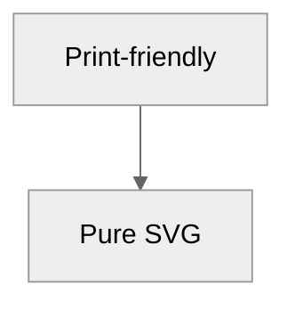
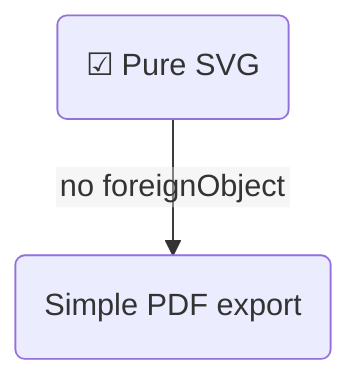

The much-talked-about “text-only” look in modern Mermaid isn’t a separate **theme** (like *forest* or *dark*) at all. It’s simply the result of telling the renderer **not to use HTML `<foreignObject>` nodes for labels**. When you switch that behaviour off (`htmlLabels:false`), Mermaid falls back to ordinary SVG `<text>` elements – so every label, title and edge caption is pure text in the SVG, with zero embedded HTML. That makes the diagram lighter, printable, and (critically for you) compatible with Playwright/Chromium PDF export because there are no zero-sized foreignObjects to trip the browser up ([GitHub][1], [GitHub][2]).

---

## 1  How to enable the “text-only” rendering

### Global/site level

```js
mermaid.initialize({
  theme: 'default',          // or dark / forest / base…
  securityLevel: 'strict',
  flowchart:   { htmlLabels: false },
  sequence:    { htmlLabels: false },   // works for any diagram type that supports it
  state:       { htmlLabels: false }
});
```

Put that in whatever file or bootstrap you already call before `MarkdownService.parse`. It works with any of the five official themes documented in the docs (`default`, `neutral`, `dark`, `forest`, `base`) ([Mermaid][3]).

### Per-diagram (front-matter or `%%{ init:… }%%`)



Front-matter YAML achieves the same and was promoted to first-class config in v10.5 ([Mermaid][4]).

---

## 2  Why you might want it

| Benefit                                        | Detail                                                                                                       |
| ---------------------------------------------- | ------------------------------------------------------------------------------------------------------------ |
| **Plays nicely with Playwright/Puppeteer/PDF** | No `<foreignObject>` means Chromium no longer skips label content with `width="0" height="0"` ([GitHub][5]). |
| **Editable in Inkscape / Illustrator**         | Pure-SVG text is fully editable; FO text often appears as blank blocks ([GitHub][1]).                        |
| **Smaller files**                              | You lose the embedded HTML boiler-plate.                                                                     |
| **Better for print/neutral docs**              | Combine with the *neutral* theme for crisp black-and-white output ([Mermaid][3]).                            |
| **Accessibility**                              | AT can now read the `<text>` nodes directly ([GitHub Docs][6]).                                              |

---

## 3  Trade-offs and limitations

* **No inline Markdown/HTML styling** – bold, italics, `<br>` line-break hacks, images, etc. rely on HTML inside the label and therefore disappear when FO is disabled ([GitHub][1]).
* **Manual wrapping** – because SVG text doesn’t wrap, very long strings will overflow their node; automatic wrapping landed in v10.1 but still favours FO, so you may need explicit `\n` breaks ([docs.mermaidchart.com][7]).
* **Old bugs resurfacing** – some vintage issues (e.g. filled-background on labels) re-appear in text mode and are still being fixed ([GitHub][2]).

---

## 4  What changed in Mermaid 11.x

1. **v11.3** – massive shape expansion and new node-metadata syntax (nothing to do with FO but worth knowing) ([Mermaid][8]).
2. **v11.5 – v11.6** – no new themes, but radar charts and curved-edge fixes landed ([GitHub][9]).
3. **Internal render pipeline rewrite** keeps `htmlLabels:true` as the default for flowcharts, so disabling it is the official path to “text-only”.

---

## 5  Tips when you flip the switch

* **Keep node sizes sane** – without FO your `fakeBBox` polyfill should return realistic text extents so JSDOM layout doesn’t collapse height.
* **Pair with Playwright patches** – your earlier fix that recalculates `viewBox` is still useful but becomes a safety-net rather than mandatory.
* **Custom theme variables still apply** – colour, font, border radius, etc. are unaffected because they live in CSS classes that style the `<rect>` / `<path>` elements ([Mermaid][3]).

---

### Quick smoke test



Render it in the Mermaid Live Editor, toggle the *PDF* or *PNG* button, and you’ll see every label survives in pure text.

---

## 6  Further reference

* GitHub Issue **#2688** – “Replace `<foreignObject>` with standard SVG” ([GitHub][1])
* StackOverflow: “`htmlLabels:false` removes foreignObject” discussion ([GitHub][1])
* Mermaid bug **#885** – edge cases with backgrounds when FO is off ([GitHub][2])
* Docusaurus report of empty labels due to FO ([GitHub][5])
* Mermaid Chart blog on automatic text wrapping ([docs.mermaidchart.com][7])
* GitHub Docs – official Mermaid support primer ([GitHub Docs][6])
* Mermaid Flowchart docs (new shape list) ([Mermaid][8])
* Theming docs (theme list & base customisation) ([Mermaid][3])
* Core configuration docs (front-matter and `initialize`) ([Mermaid][4])
* Release notes 11.6.0 (radar chart & curve fix) ([GitHub][9])

With `htmlLabels:false` in your config, you effectively get the “text-only Mermaid theme” people refer to – lean, compatible and perfect for your Playwright PDF pipeline.

[1]: https://github.com/mermaid-js/mermaid/issues/2688?utm_source=chatgpt.com "Replace foreignObject with standard SVG · Issue #2688 · mermaid ..."
[2]: https://github.com/mermaid-js/mermaid/issues/885?utm_source=chatgpt.com "Text not readable with fill styling when htmlLabels false #885 - GitHub"
[3]: https://mermaid.js.org/config/theming.html "Theme Configuration | Mermaid"
[4]: https://mermaid.js.org/config/configuration.html "Configuration | Mermaid"
[5]: https://github.com/facebook/docusaurus/issues/10526?utm_source=chatgpt.com "Mermaid diagrams do not render text nodes (empty `foreignObject`)"
[6]: https://docs.github.com/en/get-started/writing-on-github/working-with-advanced-formatting/creating-diagrams?utm_source=chatgpt.com "Creating diagrams - GitHub Docs"
[7]: https://docs.mermaidchart.com/blog/posts/automatic-text-wrapping-in-flowcharts-is-here?utm_source=chatgpt.com "Automatic text wrapping in flowcharts is here! - Mermaid Chart"
[8]: https://mermaid.js.org/syntax/flowchart.html "Flowcharts Syntax | Mermaid"
[9]: https://github.com/mermaid-js/mermaid/releases?utm_source=chatgpt.com "Releases · mermaid-js/mermaid - GitHub"
