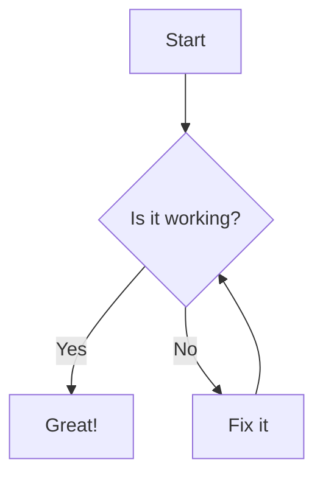

# Client-Side Mermaid Rendering Error: "Could not find a suitable point for the given distance"

## Problem Statement

The web application fails to render Mermaid diagrams in the client-side preview modal. Despite successfully loading Mermaid.js (v11.6.0), `marked`, and `DOMPurify` via an import map, and correctly identifying Mermaid code blocks, the `mermaid.run()` command throws an error: "Could not find a suitable point for the given distance". This results in a "Syntax error in text" message being displayed in the preview area where the diagram should be. The issue persists even with simple diagrams and after ensuring custom fonts ('DejaVu Sans', 'DejaVu Serif') are loaded and applied.

## Table of Contents

* [Background](#background)
* [Attempted Fixes](#attempted-fixes)
* [Hypothesis](#hypothesis)
* [Prior Research](#prior-research)
  * [src/web/default.md](#srcwebdefaultmd)
* [Dependencies](#dependencies)
  * [src/web/index.html](#srcwebindexhtml)
  * [src/web/script.js](#srcwebscriptjs)
  * [src/web/style.css](#srcwebstylecss)

## Background

The project aims to provide a Markdown to PDF conversion service with a client-side preview feature. Initially, there were issues with module loading (e.g., trying to load `@pubmd/core` which had Playwright dependencies directly on the client, and incorrect CDN URLs for client-side libraries). These have been resolved. The current architecture uses `marked`, `DOMPurify`, and `Mermaid.js` (ESM versions via CDN and import map) for the client-side preview. The `marked` library is extended to identify Mermaid code blocks and wrap them in a `<div class="mermaid">` for `mermaid.run()` to process. Custom fonts ('DejaVu Sans', 'DejaVu Serif') are fetched, converted to base64, and injected via `@font-face` rules for consistent preview styling. The main application logic, including CodeMirror editor, UI controls, and preview modal, appears to be functioning correctly, apart from the Mermaid diagram rendering.

## Attempted Fixes

1.  **Correcting Library Loading:** Ensured `marked`, `DOMPurify`, and `Mermaid.js` are loaded correctly using valid CDN URLs in the import map (`src/web/index.html`).
2.  **Reverting to Known Good State:** Reverted `index.html`, `script.js`, and `style.css` to versions from a previous commit where the overall page styling was correct.
3.  **Refactoring `script.js`:**
    *   Removed attempts to use the Node.js-specific `@pubmd/core` package directly on the client for parsing.
    *   Re-implemented client-side parsing using `marked` and `DOMPurify`.
    *   Ensured `mermaid.initialize()` is called.
    *   Ensured `mermaid.run()` is called on elements with the `.mermaid` class within the preview modal.
4.  **Font Loading:** Confirmed that 'DejaVu Sans' and 'DejaVu Serif' fonts are being fetched and `@font-face` rules are injected into the document head. The preview modal content `font-family` is set based on user preference.
5.  **Mermaid Extension for `marked`:** Verified that the custom `marked` extension correctly identifies ````mermaid` blocks and wraps their content in `<div class="mermaid">...</div>`.
6.  **DOMPurify Configuration:** Ensured DOMPurify is configured to allow `div` tags and `class` attributes necessary for Mermaid.
7.  **Simplified Test Case:** The error occurs even with a very simple Mermaid diagram like `graph TD; A-->B;` (as found in `default.md`).
8.  **Mermaid Version:** Using Mermaid.js v11.6.0, which is a relatively recent version.

## Hypothesis

The "Could not find a suitable point for the given distance" error in Mermaid.js, when rendering SVG, is often related to issues with text measurement or layout calculations within the SVG environment created by Mermaid. This could be due to:
1.  **Font Metrics:** Even though custom fonts are loaded, Mermaid might have trouble accurately determining character widths or line heights within its SVG rendering context, especially if it relies on specific browser APIs for text measurement that behave subtly differently or are affected by the CSS environment of the preview modal.
2.  **CSS Conflicts/Inheritance:** Styles applied to the preview modal or its parent elements might be interfering with Mermaid's internal styling or layout calculations for SVG elements (e.g., `display`, `line-height`, `font-size` on parent containers affecting internal SVG `text` elements).
3.  **SVG Rendering Context:** The way the SVG is embedded or sized within the preview modal might lead to calculation errors.
4.  **Mermaid Configuration:** A specific Mermaid configuration option might be missing or incorrectly set, which is crucial for robust rendering in this specific DOM and CSS context. For example, explicitly setting `fontFamily` within `mermaid.initialize()` config might be necessary, even if the surrounding div has the correct font.

Further research is needed to pinpoint the exact cause, potentially by isolating the Mermaid rendering in a simpler HTML structure or by experimenting with different Mermaid configuration options and CSS overrides.

## Prior Research
### src/web/default.md
*Code snippet begins*
#### 13. Mermaid Diagram


*Code snippet ends*

## Dependencies

### src/web/index.html
```html
<!DOCTYPE html>
<html lang="en">
<head>
    <meta charset="UTF-8">
    <meta name="viewport" content="width=device-width, initial-scale=1.0">
    <title>Markdown to PDF Converter</title>

    <!-- External CSS Libraries -->
    <link rel="stylesheet" href="https://cdnjs.cloudflare.com/ajax/libs/codemirror/5.65.15/codemirror.min.css">
    <link rel="stylesheet" href="https://cdnjs.cloudflare.com/ajax/libs/codemirror/5.65.15/theme/material-darker.min.css">

    <!-- Local CSS -->
    <link rel="stylesheet" href="style.css">

    <!-- Import Map for ES Modules -->
    <script type="importmap">
    {
        "imports": {
            "marked": "https://cdn.jsdelivr.net/npm/marked@15.0.12/lib/marked.esm.js",
            "dompurify": "https://cdn.jsdelivr.net/npm/dompurify@3.2.6/dist/purify.es.mjs",
            "mermaid": "https://cdn.jsdelivr.net/npm/mermaid@11.6.0/dist/mermaid.esm.min.mjs"
        }
    }
    </script>

    <!-- External JS Libraries (deferred) -->
    <!-- <script src="https://cdn.jsdelivr.net/npm/dompurify@2.4.0/dist/purify.min.js" defer></script> -->
    <!-- <script src="https://cdnjs.cloudflare.com/ajax/libs/marked/15.0.7/marked.min.js" defer></script> -->
    <script src="https://cdnjs.cloudflare.com/ajax/libs/html2canvas/1.4.1/html2canvas.min.js" defer></script>
    <script src="https://cdnjs.cloudflare.com/ajax/libs/jspdf/2.5.1/jspdf.umd.min.js" defer></script>
    <!-- <script src="https://cdn.jsdelivr.net/npm/mermaid/dist/mermaid.min.js" defer></script> -->
    <script src="https://cdnjs.cloudflare.com/ajax/libs/codemirror/5.65.15/codemirror.min.js" defer></script>
    <script src="https://cdnjs.cloudflare.com/ajax/libs/codemirror/5.65.15/mode/markdown/markdown.min.js" defer></script>
</head>
<body>
    <div class="container">
        <h1>Markdown to PDF Converter v3.9 (Core Integration)</h1>
        <div style="display: flex; justify-content: space-between; align-items: center; margin-bottom: 20px;">
            <input type="file" id="markdownFile" accept=".md,.txt" style="margin-bottom: 0;">
            <div class="dark-mode-toggle">
                <label class="switch"><input type="checkbox" id="darkModeToggle"><span class="slider"></span></label>
                <span class="toggle-label">Dark Mode</span>
            </div>
        </div>
        <label for="markdownInputInternal" class="label">Markdown Text:</label>
        <div id="codeMirrorPlaceholder" class="code-mirror-placeholder">Loading Editor...</div>
        <textarea id="markdownInputInternal"></textarea>
        <div class="controls-row">
            <div class="controls-left">
                <button id="clearButton" class="secondary">Clear Text</button>
                <div id="editorTogglesContainer">
                    
                </div>
            </div>
            <button id="convertToPdfButton" class="primary" disabled>Initializing...</button>
        </div>
        <div id="statusMessage">&nbsp;</div>
    </div>

    <div id="previewModalOverlay">
        <div id="previewModal">
            <div id="previewModalHeader"><h2>PDF Preview</h2></div>
            <div id="previewModalContent"></div>
            <div id="previewModalFilename">
                <label for="fileNameInputModal">Filename:</label>
                <input type="text" id="fileNameInputModal" value="md2pdf_core.pdf">
            </div>
            <div id="previewModalActions">
                <div class="font-toggle"> 
                    <label class="switch"><input type="checkbox" id="fontToggle"><span class="slider"></span></label>
                    <span class="toggle-label">Serif Font</span>
                </div>
                <div class="action-buttons"> 
                    <button id="cancelModalButton" class="secondary">Cancel</button>
                    <button id="savePdfFromModalButton" class="primary">Save PDF</button>
                </div>
            </div>
        </div>
    </div>

    <div id="renderArea"></div>

    <div class="footer">
        <p>Powered by @pubmd/core, html2canvas, jsPDF, CodeMirror.</p>
        <p>Discover more widgets at <a href="https://cgee.nz/widgets" target="_blank">Chris Barlow's Widget Workshop</a>!</p>
    </div>

    <!-- Main Application Script -->
    <script type="module" src="script.js"></script>
</body>
</html>
```

### src/web/script.js
```javascript
// Client-side libraries via import map
import { marked } from 'marked';
import DOMPurify from 'dompurify';
import mermaid from 'mermaid';

let markdownEditor;
function setPreference(name, value) { try { localStorage.setItem(name, value); } catch (e) { console.error(e); } }
function getPreference(name) { try { return localStorage.getItem(name); } catch (e) { console.error(e); return null; } }

const DEJAVU_SANS_URL = 'https://cdn.jsdelivr.net/npm/dejavu-fonts-ttf@2.37.3/ttf/DejaVuSans.ttf';
const DEJAVU_SERIF_URL = 'https://cdn.jsdelivr.net/npm/dejavu-fonts-ttf@2.37.3/ttf/DejaVuSerif.ttf';

let libsReady = false; 
let fontsReady = false; 
// let markdownServiceInstance; // No longer using core MarkdownService directly on client

// Mermaid extension for marked
function unescapeHtml(html) {
  const temp = document.createElement("textarea");
  temp.innerHTML = html; 
  return temp.value;
}

const mermaidExtension = {
  renderer: {
    code(token) { 
      const codeString = token && typeof token.text === 'string' ? token.text : ''; 
      const infostring = token && typeof token.lang === 'string' ? token.lang : '';
      const escaped = token && typeof token.escaped === 'boolean' ? token.escaped : false; 
      const lang = infostring.toLowerCase();

      if (lang === 'mermaid') {
        let mermaidContent = codeString; 
        if (escaped) {
          mermaidContent = unescapeHtml(mermaidContent);
        }
        // Return a div that mermaid.run() can target
        return `<div class="mermaid">${mermaidContent}</div>`;
      }
      return false; // Let marked handle other code blocks
    }
  }
};
marked.use(mermaidExtension);


document.addEventListener('DOMContentLoaded', () => {
    try {
        // Initialize Mermaid.js for client-side rendering in preview
        mermaid.initialize({
            startOnLoad: false, // We'll call run() manually
            theme: 'default', // Initial theme, can be updated by dark mode
            securityLevel: 'loose',
            // fontFamily: "'DejaVu Sans', sans-serif" // Set this if needed globally for mermaid
        });
        console.log('Mermaid.js initialized for client-side preview.');
    } catch (e) {
        console.error("Failed to initialize Mermaid.js:", e);
    }

    const markdownInputTextArea = document.getElementById('markdownInputInternal');
    const codeMirrorPlaceholder = document.getElementById('codeMirrorPlaceholder');
    const editorTogglesContainer = document.getElementById('editorTogglesContainer');
    const convertToPdfButton = document.getElementById('convertToPdfButton');
    // const renderArea = document.getElementById('renderArea'); // Not directly used for preview content anymore
    const statusMessage = document.getElementById('statusMessage');
    const fontToggle = document.getElementById('fontToggle');
    const darkModeToggle = document.getElementById('darkModeToggle');
    const clearButton = document.getElementById('clearButton');

    const previewModalOverlay = document.getElementById('previewModalOverlay');
    const previewModalContent = document.getElementById('previewModalContent');
    const fileNameInputModal = document.getElementById('fileNameInputModal');
    const savePdfFromModalButton = document.getElementById('savePdfFromModalButton');
    const cancelModalButton = document.getElementById('cancelModalButton');
    
    const markdownFileInput = document.getElementById('markdownFile');

    const initialDarkMode = getPreference('darkMode') === 'enabled';
    const initialSerifFont = getPreference('fontPreference') === 'serif';
    let cmTheme = initialDarkMode ? 'material-darker' : 'default';

    function updateMainButtonState() {
        // Check for client-side libraries and fonts
        if (typeof marked === 'function' && 
            typeof DOMPurify?.sanitize === 'function' && 
            typeof mermaid?.run === 'function' && 
            fontsReady && 
            typeof CodeMirror !== 'undefined' && // Check if CodeMirror is loaded
            markdownEditor // Check if CodeMirror instance is ready
           ) {
            libsReady = true;
            if (convertToPdfButton) {
                convertToPdfButton.disabled = false;
                convertToPdfButton.textContent = 'Preview PDF';
            }
            statusMessage.textContent = 'Ready.'; statusMessage.style.color = 'green';
        } else if (!fontsReady) {
            libsReady = false;
            if (convertToPdfButton) {
                convertToPdfButton.disabled = true;
                convertToPdfButton.textContent = 'Loading Fonts...';
            }
            statusMessage.textContent = 'Please wait, loading fonts for preview...'; statusMessage.style.color = '#333';
        } else if (typeof CodeMirror === 'undefined' || !markdownEditor) {
            libsReady = false;
            if (convertToPdfButton) {
                convertToPdfButton.disabled = true;
                convertToPdfButton.textContent = 'Loading Editor...';
            }
            statusMessage.textContent = 'Please wait, editor loading...'; statusMessage.style.color = '#333';
        }
        else { 
            libsReady = false;
            if (convertToPdfButton) {
                convertToPdfButton.disabled = true;
                convertToPdfButton.textContent = 'Libs Missing';
            }
            statusMessage.textContent = 'Error: Client-side libraries missing. Check console.'; statusMessage.style.color = 'red';
            console.error("Missing client-side libraries: ", {marked, DOMPurify, mermaid, CodeMirror});
        }
    }
    
    async function arrayBufferToBase64(buffer) {
        let binary = '';
        const bytes = new Uint8Array(buffer);
        const len = bytes.byteLength;
        for (let i = 0; i < len; i++) {
            binary += String.fromCharCode(bytes[i]);
        }
        return window.btoa(binary);
    }

    let fontBase64Sans = null;
    let fontBase64Serif = null;

    async function loadFontAsBase64ForPreview(fontUrl, fontNameForLog) {
        try {
            const response = await fetch(fontUrl);
            if (!response.ok) throw new Error(`Failed to fetch ${fontUrl}: ${response.statusText}`);
            const fontBlob = await response.arrayBuffer();
            const fontBase64 = await arrayBufferToBase64(fontBlob);
            console.log(`${fontNameForLog} font fetched and converted to base64 from ${fontUrl} for preview.`);
            return fontBase64;
        } catch (error) {
            console.error(`Error loading font ${fontNameForLog} from ${fontUrl} for preview:`, error);
            statusMessage.textContent = `Error loading font for preview: ${fontNameForLog}.`;
            statusMessage.style.color = 'red';
            return null;
        }
    }

    async function initializeFontsForPreview() {
        statusMessage.textContent = 'Loading fonts for preview...';
        fontBase64Sans = await loadFontAsBase64ForPreview(DEJAVU_SANS_URL, 'DejaVuSans');
        fontBase64Serif = await loadFontAsBase64ForPreview(DEJAVU_SERIF_URL, 'DejaVuSerif');

        if (fontBase64Sans && fontBase64Serif) {
            const fontFaceStyle = document.createElement('style');
            fontFaceStyle.textContent = `
              @font-face{
                font-family:'DejaVu Sans';
                src:url(data:font/ttf;base64,${fontBase64Sans}) format('truetype');
              }
              @font-face{
                font-family:'DejaVu Serif';
                src:url(data:font/ttf;base64,${fontBase64Serif}) format('truetype');
              }`;
            document.head.appendChild(fontFaceStyle);
            console.log("DejaVu @font-face rules injected into document head for preview.");
            fontsReady = true;
        } else {
            console.error("One or more DejaVu fonts failed to be fetched for preview.");
            statusMessage.textContent = 'Error loading custom fonts for preview.';
            statusMessage.style.color = 'red';
            fontsReady = false; 
        }
        updateMainButtonState(); 
    }

    const updateUIStates = (isDarkModeActive, isSerifFontActive) => {
        const mermaidTheme = isDarkModeActive ? 'dark' : 'default'; // Use 'dark' for Mermaid dark theme
        if (typeof mermaid?.initialize === 'function') {
            // Re-initialize or update config if mermaid allows dynamic theme changes without full re-init
             mermaid.initialize({ startOnLoad: false, theme: mermaidTheme, securityLevel: 'loose' });
        }

        if (isDarkModeActive) {
            document.documentElement.classList.add('dark-mode');
            if (darkModeToggle) darkModeToggle.checked = true;
            if (markdownEditor?.setOption) markdownEditor.setOption("theme", "material-darker");
        } else {
            document.documentElement.classList.remove('dark-mode');
            if (darkModeToggle) darkModeToggle.checked = false;
            if (markdownEditor?.setOption) markdownEditor.setOption("theme", "default");
        }
        if (fontToggle) fontToggle.checked = isSerifFontActive;

        const currentFontFamily = isSerifFontActive ? "'DejaVu Serif', serif" : "'DejaVu Sans', sans-serif";
        if (previewModalContent) previewModalContent.style.fontFamily = currentFontFamily;
    };
    
    // Initialize fonts first, then CodeMirror and other UI elements
    initializeFontsForPreview().then(() => {
        updateUIStates(initialDarkMode, initialSerifFont); // Apply initial theme settings

        if (typeof CodeMirror !== 'undefined') {
             markdownEditor = CodeMirror.fromTextArea(markdownInputTextArea, {
                mode: 'markdown', lineNumbers: true, lineWrapping: true, theme: cmTheme,
                autofocus: true, styleActiveLine: true, matchBrackets: true,
            });
            if (markdownEditor && markdownEditor.getWrapperElement) { 
                markdownEditor.getWrapperElement().style.opacity = '1'; 
            }
            if (codeMirrorPlaceholder) codeMirrorPlaceholder.style.display = 'none';
            if (editorTogglesContainer) editorTogglesContainer.style.opacity = '1';
            updateMainButtonState(); // Update button state after CM is ready
        } else {
            console.error("CodeMirror not loaded. Falling back to plain textarea.");
            if (codeMirrorPlaceholder) codeMirrorPlaceholder.textContent = "CodeMirror failed to load.";
            markdownInputTextArea.style.display = 'block'; // Show textarea if CM fails
            markdownInputTextArea.classList.add('raw-textarea'); // Add class for basic styling
            markdownEditor = { // Basic fallback for editor
                getValue: () => markdownInputTextArea.value,
                setValue: (v) => markdownInputTextArea.value = v,
                focus: () => markdownInputTextArea.focus(),
                setOption: () => {},
                refresh: () => {},
                getWrapperElement: () => markdownInputTextArea 
            };
            if (editorTogglesContainer) editorTogglesContainer.style.opacity = '1';
            updateMainButtonState();
        }

        fetch('default.md')
            .then(response => {
                if (!response.ok) {
                    console.warn(`Could not load default.md: ${response.statusText}. Editor will be empty or show an error.`);
                    return "# Error: Could not load default example content.";
                }
                return response.text();
            })
            .then(defaultMarkdownText => {
                if(markdownEditor) markdownEditor.setValue(defaultMarkdownText);
            })
            .catch(error => {
                console.error('Error fetching default.md:', error);
                if(markdownEditor) markdownEditor.setValue("# Error: Failed to fetch default example content.");
            });

        if (convertToPdfButton) convertToPdfButton.addEventListener('click', prepareContentForPreviewAndPdf);

        if (cancelModalButton) {
            cancelModalButton.addEventListener('click', () => {
                previewModalOverlay.style.display = 'none';
                previewModalContent.innerHTML = '';
                statusMessage.textContent = 'PDF generation cancelled.';
            });
        }

        if (savePdfFromModalButton) savePdfFromModalButton.addEventListener('click', savePdfHandler);
        
        if (darkModeToggle) darkModeToggle.addEventListener('change', () => {
            const isChecked = darkModeToggle.checked;
            cmTheme = isChecked ? 'material-darker' : 'default'; 
            setPreference('darkMode', isChecked ? 'enabled' : 'disabled');
            updateUIStates(isChecked, fontToggle ? fontToggle.checked : false);
        });
        
        if (fontToggle) fontToggle.addEventListener('change', () => {
            const isChecked = fontToggle.checked;
            setPreference('fontPreference', isChecked ? 'serif' : 'sans-serif');
            updateUIStates(darkModeToggle ? darkModeToggle.checked : false, isChecked);
        });
        
        if (clearButton) clearButton.addEventListener('click', () => {
            if(markdownEditor) {
                markdownEditor.setValue('');
                setTimeout(() => { if (markdownEditor.refresh) markdownEditor.refresh(); markdownEditor.focus(); }, 10); 
            }
        });

        if (markdownFileInput) {
            markdownFileInput.addEventListener('change', (event) => {
                const file = event.target.files[0];
                if (file) {
                    const reader = new FileReader();
                    reader.onload = (e) => {
                        if (markdownEditor) {
                            markdownEditor.setValue(e.target.result);
                            setTimeout(() => { if (markdownEditor.refresh) markdownEditor.refresh(); }, 10); 
                            statusMessage.textContent = `File "${file.name}" loaded.`;
                            statusMessage.style.color = 'green';
                            previewModalContent.innerHTML = ''; 
                            updateMainButtonState();
                        }
                    };
                    reader.onerror = () => {
                        statusMessage.textContent = `Error reading file "${file.name}".`;
                        statusMessage.style.color = 'red';
                    };
                    reader.readAsText(file);
                }
            });
        }
    }); 

    async function prepareContentForPreviewAndPdf() {
        if (!libsReady || !fontsReady) { 
            statusMessage.textContent = 'Client libraries or fonts not ready. Please wait.';
            statusMessage.style.color = 'orange';
            return false;
        }

        if (convertToPdfButton) {
            convertToPdfButton.disabled = true;
            convertToPdfButton.textContent = 'Processing...';
        }
        statusMessage.textContent = 'Preparing preview...';

        const mdText = markdownEditor.getValue();
        if (!mdText.trim()) {
            statusMessage.textContent = 'Please enter some Markdown.';
            statusMessage.style.color = 'red';
            if (convertToPdfButton) {
                convertToPdfButton.disabled = false;
                convertToPdfButton.textContent = 'Preview PDF';
            }
            return false;
        }

        let htmlContentToPreview;
        try {
            // Use client-side marked and DOMPurify for preview
            const rawHtml = marked.parse(mdText, { 
                gfm: true, 
                breaks: true, 
                headerIds: true 
                // Mermaid extension is already applied to marked instance
            });
            htmlContentToPreview = DOMPurify.sanitize(rawHtml, { 
                USE_PROFILES: { html: true }, 
                ADD_TAGS: ['div'], // Ensure 'div' is allowed for Mermaid
                ADD_ATTR: ['class'] // Ensure 'class' is allowed for Mermaid
            });
        } catch (error) {
            console.error("Error during client-side Markdown processing for preview:", error);
            previewModalContent.innerHTML = `<p style="color:red;">Error processing Markdown for preview: ${error.message}</p>`;
            previewModalOverlay.style.display = 'flex'; 
            statusMessage.textContent = "Error processing Markdown for preview. Check console.";
            statusMessage.style.color = 'red';
            if (convertToPdfButton) {
                convertToPdfButton.disabled = false;
                convertToPdfButton.textContent = 'Preview PDF';
            }
            return false;
        }
        
        const isSerifUserChoice = fontToggle && fontToggle.checked;
        const userFontFamilyCSS = isSerifUserChoice ? "'DejaVu Serif', serif" : "'DejaVu Sans', sans-serif";
        
        previewModalContent.style.fontFamily = userFontFamilyCSS;
        previewModalContent.style.fontSize = '12pt'; 
        previewModalContent.style.backgroundColor = 'white';
        previewModalContent.style.color = 'black'; 
        const dpi = 96;
        const a4WidthInPx = Math.floor(210 * dpi / 25.4);
        const marginInPxModal = Math.floor(10 * dpi / 25.4); 
        previewModalContent.style.width = (a4WidthInPx - 2 * marginInPxModal) + 'px';
        previewModalContent.style.padding = marginInPxModal + 'px';
        
        previewModalContent.innerHTML = htmlContentToPreview; 
        
        // Run Mermaid on the preview content
        try {
            if (typeof mermaid?.run === 'function') {
                const mermaidElements = previewModalContent.querySelectorAll('.mermaid');
                console.log(`[Preview] Found ${mermaidElements.length} elements with class 'mermaid' for Mermaid.run().`);
                if (mermaidElements.length > 0) {
                    await mermaid.run({ nodes: mermaidElements });
                    console.log("[Preview] Client-side Mermaid.run() executed.");
                }
            } else {
                console.warn("[Preview] Mermaid.run() not available or mermaidElements not found.");
            }
        } catch (e) {
            console.error("[Preview] Error running Mermaid on preview content:", e);
            const errorDiv = document.createElement('div');
            errorDiv.style.color = 'red';
            errorDiv.textContent = "Error rendering Mermaid diagram in preview: " + (e.message || e.str || 'Unknown error');
            previewModalContent.appendChild(errorDiv);
        }
        
        fileNameInputModal.value = `pubmd_doc_${new Date().toISOString().slice(0,10).replace(/-/g,'')}.pdf`;
        previewModalOverlay.style.display = 'flex';

        statusMessage.textContent = 'Preview ready.';
        if (convertToPdfButton) {
            convertToPdfButton.disabled = false;
            convertToPdfButton.textContent = 'Update Preview';
        }
        return true;
    }

    async function savePdfHandler() {
        const rawMarkdownText = markdownEditor.getValue();
        if (!rawMarkdownText.trim()) {
            statusMessage.textContent = 'Cannot generate PDF from empty Markdown.';
            statusMessage.style.color = 'red';
            return;
        }

        let fileName = fileNameInputModal.value.trim();
        if (!fileName) fileName = "pubmd_document.pdf";
        if (!fileName.toLowerCase().endsWith('.pdf')) fileName += '.pdf';

        savePdfFromModalButton.disabled = true;
        savePdfFromModalButton.textContent = 'Generating PDF...';
        statusMessage.textContent = 'Sending to server for PDF generation... please wait.';
        statusMessage.style.color = '#333';
        
        const currentFontPreference = (fontToggle && fontToggle.checked) ? 'serif' : 'sans';
        const currentMermaidTheme = (darkModeToggle && darkModeToggle.checked) ? 'dark' : 'default';

        // Payload for the server, which will use @pubmd/core
        const serverPayload = {
            markdown: rawMarkdownText,
            pdfOptions: { // Options for Playwright on the server
                pageFormat: 'a4',
                orientation: 'portrait',
                margins: { top: 15, right: 15, bottom: 15, left: 15 }, // in mm
                printBackground: true,
            },
            markdownOptions: { // Options for MarkdownService on the server
                gfm: true,
                breaks: true,
                headerIds: true,
                sanitizeHtml: true, 
                mermaidTheme: currentMermaidTheme, 
                mermaidSecurityLevel: 'loose',
            },
            fontPreference: currentFontPreference // 'sans' or 'serif'
        };

        try {
            console.log("Sending Markdown to server for PDF generation. Payload:", serverPayload);
            
            // Ensure this endpoint matches your server's route
            const response = await fetch('http://localhost:3001/api/generate-pdf-from-markdown', {
                method: 'POST',
                headers: {
                    'Content-Type': 'application/json',
                },
                body: JSON.stringify(serverPayload),
            });

            if (!response.ok) {
                const errorText = await response.text();
                throw new Error(`Server error: ${response.status} ${response.statusText}. ${errorText}`);
            }

            const pdfBlob = await response.blob();

            const url = URL.createObjectURL(pdfBlob);
            const a = document.createElement('a');
            a.href = url;
            a.download = fileName;
            document.body.appendChild(a);
            a.click();
            document.body.removeChild(a);
            URL.revokeObjectURL(url);

            statusMessage.textContent = 'PDF generated successfully: ' + fileName;
            statusMessage.style.color = 'green';
            previewModalOverlay.style.display = 'none';

        } catch (error) {
            console.error("Error generating PDF via server:", error);
            statusMessage.textContent = `Error generating PDF: ${error.message}. Check console.`;
            statusMessage.style.color = 'red';
        } finally {
            savePdfFromModalButton.disabled = false;
            savePdfFromModalButton.textContent = 'Save PDF';
        }
    }
});
```

### src/web/style.css
```css
body {
    font-family: -apple-system, BlinkMacSystemFont, "Segoe UI", Roboto, Helvetica, Arial, sans-serif, "Apple Color Emoji", "Segoe UI Emoji", "Segoe UI Symbol";
    margin: 0; padding: 20px; background-color: #f0f2f5; color: #1c1e21;
    display: flex; flex-direction: column; align-items: center; min-height: 100vh;
    transition: background-color 0.3s, color 0.3s;
}
body.preload .slider, body.preload .slider:before { transition: none !important; } 


html.dark-mode body { background-color: #18191a; color: #e4e6eb; }

.container {
    background-color: #ffffff; padding: 30px; border-radius: 12px;
    box-shadow: 0 4px 12px rgba(0, 0, 0, 0.1); width: 100%; max-width: 800px;
    box-sizing: border-box; transition: background-color 0.3s;
}
html.dark-mode .container { background-color: #242526; box-shadow: 0 4px 12px rgba(0, 0, 0, 0.3); }

h1 { color: #0a66c2; text-align: center; margin-bottom: 30px; font-size: 2em; transition: color 0.3s; }
html.dark-mode h1 { color: #58a6ff; }

.label { display: block; font-weight: 600; margin-bottom: 8px; color: #333; font-size: 1.1em; transition: color 0.3s; }
html.dark-mode .label { color: #dadce1; }

textarea#markdownInputInternal { display: none; }
.code-mirror-placeholder {
    min-height: 400px; border: 1px solid #ccd0d5; border-radius: 6px; margin-bottom: 20px;
    background-color: #f8f9fa; display: flex; align-items: center; justify-content: center;
    color: #6c757d; font-style: italic; box-sizing: border-box;
    transition: background-color 0.3s, border-color 0.3s, color 0.3s;
}
html.dark-mode .code-mirror-placeholder { background-color: #3a3b3c; border-color: #555; color: #adb5bd; }

.CodeMirror {
    border: 1px solid #ccd0d5; border-radius: 6px; min-height: 400px; font-size: 1em;
    line-height: 1.5; font-family: Consolas, Monaco, 'Andale Mono', 'Ubuntu Mono', monospace;
    margin-bottom: 20px; opacity: 0; /* Initial opacity for transition */
    transition: border-color 0.3s, opacity 0.2s ease-in-out;
}
html.dark-mode .CodeMirror.cm-s-material-darker {
    border-color: #555 !important; background-color: #1E1E1E !important; color: #D4D4D4 !important;
}
html.dark-mode .CodeMirror.cm-s-material-darker .CodeMirror-gutters {
    background-color: #1E1E1E !important; border-right: 1px solid #444 !important; color: #858585 !important;
}
html.dark-mode .CodeMirror.cm-s-material-darker .cm-header { color: #569CD6 !important; font-weight: bold !important; }


input[type="file"] {
    display: block; padding: 10px; border: 1px solid #ccd0d5; border-radius: 6px;
    cursor: pointer; margin: 0 0 30px 0; transition: border-color 0.3s, background-color 0.3s;
}
html.dark-mode input[type="file"] { background-color: #3a3b3c; border-color: #555; color: #e4e6eb; }

.controls-row { display: flex; justify-content: space-between; align-items: center; margin-top: 10px; }
.controls-left { display: flex; align-items: center; gap: 15px; }
#editorTogglesContainer { display: flex; align-items: center; gap: 15px; opacity: 0; transition: opacity 0.3s ease-in-out 0.1s; }

input[type="file"]::file-selector-button, button.secondary {
    border: none; background: #0a66c2; padding: 8px 12px; border-radius: 4px; color: #fff;
    cursor: pointer; transition: background-color .2s ease-in-out; font-family: inherit;
}
html.dark-mode input[type="file"]::file-selector-button,
html.dark-mode button.secondary { background: #3081d2; color: #e4e6eb; }

button.primary {
    background-color: #0a66c2; color: white; border: none; padding: 12px 25px;
    border-radius: 6px; font-size: 1em; font-weight: 600; cursor: pointer;
    transition: background-color 0.2s ease-in-out; font-family: inherit;
}
html.dark-mode button.primary { background-color: #3081d2; color: #e4e6eb; }
button:disabled { background-color: #cccccc; color: #666666; cursor: not-allowed; }
html.dark-mode button:disabled { background-color: #404040; color: #888888; }

#statusMessage { text-align:center; margin-top:15px; font-weight:bold; min-height: 1.2em; line-height: 1.2em; }
.footer { text-align: center; margin-top: 30px; font-size: 0.9em; color: #606770; transition: color 0.3s; }
html.dark-mode .footer { color: #b0b3b8; }
.footer a { color: #0a66c2; text-decoration: none; transition: color 0.3s; }
html.dark-mode .footer a { color: #58a6ff; }

.switch { position: relative; display: inline-block; width: 50px; height: 24px; }
.switch input { opacity: 0; width: 0; height: 0; }
.slider { position: absolute; cursor: pointer; top: 0; left: 0; right: 0; bottom: 0; background-color: #ccd0d5; transition: .2s; border-radius: 24px; }
html.dark-mode .slider { background-color: #555; }
.slider:before { position: absolute; content: ""; height: 16px; width: 16px; left: 4px; bottom: 4px; background-color: white; transition: .2s; border-radius: 50%; }
input:checked + .slider { background-color: #0a66c2; }
html.dark-mode input:checked + .slider { background-color: #3081d2; }
input:checked + .slider:before { transform: translateX(26px); }
.toggle-label { font-size: 0.9em; color: #666; white-space: nowrap; transition: color 0.3s; margin-left: 5px; vertical-align: middle;}
html.dark-mode .toggle-label { color: #b0b3b8; }
.font-toggle, .dark-mode-toggle { display: flex; align-items: center; }


.mermaid svg { max-width: 100%; height: auto; }

#renderArea {
    position: absolute; left: -9999px; top: 0; visibility: hidden;
    padding: 0; box-sizing: border-box;
    /* font-family will be set by JS */
    color: black; background-color: white;
    font-size: 12pt; overflow-wrap: break-word;
}
#renderArea h1, #renderArea h2, #renderArea h3, #renderArea h4, #renderArea h5, #renderArea h6 { color: black; text-align: left; overflow-wrap: break-word;}
#renderArea h1 { font-size: 24pt; margin-bottom: 12pt;}
#renderArea h2 { font-size: 18pt; margin-bottom: 10pt;}
#renderArea h3 { font-size: 14pt; margin-bottom: 8pt;}
#renderArea p { font-size: 12pt; line-height: 1.5; margin-bottom: 10pt; color: black; overflow-wrap: break-word; }
#renderArea ul, #renderArea ol { margin-bottom: 10pt; padding-left: 20pt; color: black; } /* Standard list styling */
#renderArea li { font-size: 12pt; margin-bottom: 5pt; color: black; overflow-wrap: break-word; } /* Standard li styling */
#renderArea strong, #renderArea b { color: black; font-weight: bold; }
#renderArea em, #renderArea i { color: black; font-style: italic; }
#renderArea pre {
    background-color: #f5f5f5; border: 1px solid #ccc; padding: 10px; border-radius: 4px;
    overflow-x: auto; font-family: 'Courier New', Courier, monospace; font-size: 10pt; color: black;
    white-space: pre-wrap; word-wrap: break-word;
}
#renderArea code {
    font-family: 'Courier New', Courier, monospace; background-color: #f0f0f0;
    padding: 2px 4px; border-radius: 3px; font-size: 0.9em; color: black;
    word-break: break-all; overflow-wrap: break-word;
}
#renderArea pre code { background-color: transparent; padding: 0; border-radius: 0; font-size: 1em; }
#renderArea blockquote { border-left: 3px solid #ccc; padding-left: 10px; margin-left: 0; font-style: italic; color: black; overflow-wrap: break-word; }
#renderArea table { border-collapse: collapse; width: 100%; margin-bottom: 15px; }
#renderArea th, #renderArea td { border: 1px solid #ddd; padding: 8px; text-align: left; color: black; overflow-wrap: break-word; }
#renderArea th { background-color: #f2f2f2; }
#renderArea img { max-width: 100%; height: auto; display: block; margin: 10px 0; }

#previewModalOverlay {
    display: none; position: fixed; top: 0; left: 0; width: 100%; height: 100%;
    background-color: rgba(0,0,0,0.5); z-index: 1000;
    justify-content: center; align-items: center;
}
#previewModal {
    background-color: white; color: black;
    padding: 25px; border-radius: 8px; box-shadow: 0 5px 15px rgba(0,0,0,0.3);
    width: 90%; max-width: 700px;
    max-height: 90vh; display: flex; flex-direction: column;
}
#previewModalHeader { margin-bottom: 15px; padding-bottom: 10px; border-bottom: 1px solid #eee; }
#previewModalHeader h2 { margin: 0; font-size: 1.5em; }
#previewModalContent {
    overflow-y: auto; flex-grow: 1;
    border: 1px solid #ccc; padding: 15px;
    /* font-family will be set by JS */ font-size: 12pt;
    background-color: white; color: black;
}
#previewModalContent h1, #previewModalContent h2, #previewModalContent h3 { color: black; }
#previewModalContent p, #previewModalContent li { color: black; } 
#previewModalContent ul, #previewModalContent ol { padding-left: 20pt; }


#previewModalContent strong, #previewModalContent b { font-weight: bold; color: black; }
#previewModalContent em, #previewModalContent i { font-style: italic; color: black; }
#previewModalContent pre { background-color: #f5f5f5; border: 1px solid #ccc; padding: 10px; color: black; }
#previewModalContent code { background-color: #f0f0f0; padding: 2px 4px; color: black; }
#previewModalContent pre code { background-color: transparent; }
#previewModalContent blockquote { border-left: 3px solid #ccc; padding-left: 10px; color: #555; }
#previewModalContent table { border-collapse: collapse; width: 100%; }
#previewModalContent th, #previewModalContent td { border: 1px solid #ddd; padding: 8px; color: black; }
#previewModalContent th { background-color: #f2f2f2; }
#previewModalContent .mermaid svg { max-width: 100%; height: auto; }

#previewModalFilename { margin-top: 20px; }
#previewModalFilename label { display: block; margin-bottom: 5px; font-weight: bold; }
#fileNameInputModal { width: calc(100% - 22px); padding: 10px; border: 1px solid #ccc; border-radius: 4px; }

#previewModalActions {
    margin-top: 20px;
    display: flex; 
    justify-content: space-between; 
    align-items: center; 
}
#previewModalActions .action-buttons { 
    display: flex;
    gap: 10px;
}
#previewModalActions button { 
     padding: 10px 20px;
}
#previewModalActions .font-toggle {
    margin-right: auto; 
}