# Mermaid `getComputedTextLength` Polyfill Issues in JSDOM for Text-Only Rendering

## Problem Statement

When rendering Mermaid diagrams with `htmlLabels: false` (for text-only SVG output) within a Node.js environment using JSDOM, Mermaid's internal text measurement function `computeWidthOfText` fails with the error `TypeError: testSpan.node(...).getComputedTextLength is not a function`. This occurs because the JSDOM environment, even with existing polyfills for `getBBox`, does not provide a fully functional `getComputedTextLength` method on SVG text-related elements (`SVGTextContentElement`, `SVGTSpanElement`, `SVGTextElement`) that Mermaid expects for pure SVG text measurement.

## Table of Contents

* [Background](#background)
* [Attempted Fixes](#attempted-fixes)
* [Hypothesis](#hypothesis)
* [Prior Research](#prior-research)
  * [documentation/03_Implementation/issue_research_20250521_mermaid-diagram-issue_take8_pivot_o3_mermaid_text_only.md](#documentation03_implementationissue_research_20250521_mermaid-diagram-issue_take8_pivot_o3_mermaid_text_onlymd)
* [Dependencies](#dependencies)
  * [nodejs_projects/core/src/services/markdown/markdown.service.ts](#nodejs_projectscoreservicesmarkdownmarkdownservicets)
  * [nodejs_projects/core/scripts/test-pdf-service.mjs](#nodejs_projectscorescriptstest-pdf-servicemjs)

## Background

The project aims to generate PDFs from Markdown content, including Mermaid diagrams. To improve PDF compatibility and avoid issues with `<foreignObject>` rendering in Playwright/Chromium, the `MarkdownService` was updated to configure Mermaid with `htmlLabels: false`. This forces Mermaid to use SVG `<text>` elements instead of HTML for labels.

However, when running the `test-pdf-service.mjs` script, which uses `MarkdownService` in a JSDOM environment, Mermaid throws an error during text measurement, specifically because `getComputedTextLength` is not available or not functioning as expected on the SVG text nodes created by JSDOM.

## Attempted Fixes

1.  **Initial Polyfill for `getComputedTextLength`**:
    *   A `fakeGetComputedTextLength` function was added to `test-pdf-service.mjs`.
    *   This function was conditionally applied to `SVGTextContentElement.prototype`, `SVGTSpanElement.prototype`, and `SVGTextElement.prototype` if `getComputedTextLength` was not already present.
    *   **Result**: The error persisted. Console logs indicated the polyfill was not applied, suggesting JSDOM already provided *some* version of `getComputedTextLength` on these prototypes, or the prototypes themselves weren't being accessed correctly via `window[className]`.

2.  **Forced Polyfill Application**:
    *   The polyfill application logic in `test-pdf-service.mjs` was modified to unconditionally overwrite `getComputedTextLength` on the relevant prototypes.
    *   **Result**: The error persisted. New console warnings appeared: `Could not find window.SVGTextContentElement or its prototype to polyfill getComputedTextLength.` (and similar for `SVGTSpanElement` and `SVGTextElement`). This indicated that accessing SVG element constructors/prototypes via `window[className]` was unreliable in the JSDOM setup.

## Hypothesis

The `getComputedTextLength` method, as implemented or stubbed by JSDOM on SVG text-related element prototypes, is either non-functional, returns unexpected values, or is not discoverable/overwritable through the methods previously attempted. Mermaid's text measurement logic for `htmlLabels: false` strictly requires a working `getComputedTextLength`.

A more robust method of accessing the SVG element prototypes (e.g., via `Object.getPrototypeOf(document.createElementNS(...))`) is needed to correctly apply the polyfill. If JSDOM's native `getComputedTextLength` cannot be made to work or be reliably overridden, a more sophisticated polyfill that accurately mimics browser behavior for this function might be necessary, or Mermaid's interaction with JSDOM for text measurement needs deeper investigation.

## Prior Research

### documentation/03_Implementation/issue_research_20250521_mermaid-diagram-issue_take8_pivot_o3_mermaid_text_only.md
```markdown
The much-talked-about “text-only” look in modern Mermaid isn’t a separate **theme** (like *forest* or *dark*) at all. It’s simply the result of telling the renderer **not to use HTML `<foreignObject>` nodes for labels**. When you switch that behaviour off (`htmlLabels:false`), Mermaid falls back to ordinary SVG `<text>` elements – so every label, title and edge caption is pure text in the SVG, with zero embedded HTML. That makes the diagram lighter, printable, and (critically for you) compatible with Playwright/Chromium PDF export because there are no zero-sized foreignObjects to trip the browser up ([GitHub][1], [GitHub][2]).

---

## 1  How to enable the “text-only” rendering

### Global/site level

```js
mermaid.initialize({
  theme: 'default',          // or dark / forest / base…
  securityLevel: 'strict',
  flowchart:   { htmlLabels: false },
  sequence:    { htmlLabels: false },   // works for any diagram type that supports it
  state:       { htmlLabels: false }
});
```

Put that in whatever file or bootstrap you already call before `MarkdownService.parse`. It works with any ofthe five official themes documented in the docs (`default`, `neutral`, `dark`, `forest`, `base`) ([Mermaid][3]).

### Per-diagram (front-matter or `%%{ init:… }%%`)


Front-matter YAML achieves the same and was promoted to first-class config in v10.5 ([Mermaid][4]).

---

## 2  Why you might want it

| Benefit                                        | Detail                                                                                                       |
| ---------------------------------------------- | ------------------------------------------------------------------------------------------------------------ |
| **Plays nicely with Playwright/Puppeteer/PDF** | No `<foreignObject>` means Chromium no longer skips label content with `width="0" height="0"` ([GitHub][5]). |
| **Editable in Inkscape / Illustrator**         | Pure-SVG text is fully editable; FO text often appears as blank blocks ([GitHub][1]).                        |
| **Smaller files**                              | You lose the embedded HTML boiler-plate.                                                                     |
| **Better for print/neutral docs**              | Combine with the *neutral* theme for crisp black-and-white output ([Mermaid][3]).                            |
| **Accessibility**                              | AT can now read the `<text>` nodes directly ([GitHub Docs][6]).                                              |

---

## 3  Trade-offs and limitations

* **No inline Markdown/HTML styling** – bold, italics, `<br>` line-break hacks, images, etc. rely on HTML inside the label and therefore disappear when FO is disabled ([GitHub][1]).
* **Manual wrapping** – because SVG text doesn’t wrap, very long strings will overflow their node; automatic wrapping landed in v10.1 but still favours FO, so you may need explicit `\n` breaks ([docs.mermaidchart.com][7]).
* **Old bugs resurfacing** – some vintage issues (e.g. filled-background on labels) re-appear in text mode and are still being fixed ([GitHub][2]).

---

## 4  What changed in Mermaid 11.x

1. **v11.3** – massive shape expansion and new node-metadata syntax (nothing to do with FO but worth knowing) ([Mermaid][8]).
2. **v11.5 – v11.6** – no new themes, but radar charts and curved-edge fixes landed ([GitHub][9]).
3. **Internal render pipeline rewrite** keeps `htmlLabels:true` as the default for flowcharts, so disabling it is the official path to “text-only”.

---

## 5  Tips when you flip the switch

* **Keep node sizes sane** – without FO your `fakeBBox` polyfill should return realistic text extents so JSDOM layout doesn’t collapse height.
* **Pair with Playwright patches** – your earlier fix that recalculates `viewBox` is still useful but becomes a safety-net rather than mandatory.
* **Custom theme variables still apply** – colour, font, border radius, etc. are unaffected because they live in CSS classes that style the `<rect>` / `<path>` elements ([Mermaid][3]).

---

### Quick smoke test

```mermaid
%%{init: {'flowchart':{'htmlLabels':false}}}%%
flowchart TD
    A("☑ Pure SVG") -->|no foreignObject| B(Simple PDF export)
```



Render it in the Mermaid Live Editor, toggle the *PDF* or *PNG* button, and you’ll see every label survives in pure text.

---

## 6  Further reference

* GitHub Issue **#2688** – “Replace `<foreignObject>` with standard SVG” ([GitHub][1])
* StackOverflow: “`htmlLabels:false` removes foreignObject” discussion ([GitHub][1])
* Mermaid bug **#885** – edge cases with backgrounds when FO is off ([GitHub][2])
* Docusaurus report of empty labels due to FO ([GitHub][5])
* Mermaid Chart blog on automatic text wrapping ([docs.mermaidchart.com][7])
* GitHub Docs – official Mermaid support primer ([GitHub Docs][6])
* Mermaid Flowchart docs (new shape list) ([Mermaid][8])
* Theming docs (theme list & base customisation) ([Mermaid][3])
* Core configuration docs (front-matter and `initialize`) ([Mermaid][4])
* Release notes 11.6.0 (radar chart & curve fix) ([GitHub][9])

With `htmlLabels:false` in your config, you effectively get the “text-only Mermaid theme” people refer to – lean, compatible and perfect for your Playwright PDF pipeline.

[1]: https://github.com/mermaid-js/mermaid/issues/2688?utm_source=chatgpt.com "Replace foreignObject with standard SVG · Issue #2688 · mermaid ..."
[2]: https://github.com/mermaid-js/mermaid/issues/885?utm_source=chatgpt.com "Text not readable with fill styling when htmlLabels false #885 - GitHub"
[3]: https://mermaid.js.org/config/theming.html "Theme Configuration | Mermaid"
[4]: https://mermaid.js.org/config/configuration.html "Configuration | Mermaid"
[5]: https://github.com/facebook/docusaurus/issues/10526?utm_source=chatgpt.com "Mermaid diagrams do not render text nodes (empty `foreignObject`)"
[6]: https://docs.github.com/en/get-started/writing-on-github/working-with-advanced-formatting/creating-diagrams?utm_source=chatgpt.com "Creating diagrams - GitHub Docs"
[7]: https://docs.mermaidchart.com/blog/posts/automatic-text-wrapping-in-flowcharts-is-here?utm_source=chatgpt.com "Automatic text wrapping in flowcharts is here! - Mermaid Chart"
[8]: https://mermaid.js.org/syntax/flowchart.html "Flowcharts Syntax | Mermaid"
[9]: https://github.com/mermaid-js/mermaid/releases?utm_source=chatgpt.com "Releases · mermaid-js/mermaid - GitHub"
```

## Dependencies

### nodejs_projects/core/src/services/markdown/markdown.service.ts
```typescript
import { marked, Renderer, Tokens } from 'marked';
import mermaid from 'mermaid';
// DOMPurify is no longer imported directly. It's expected to be on globalThis.
import { IMarkdownService, MarkdownParseOptions, MermaidTheme, MermaidSecurityLevel } from './markdown-types.js';

const DEFAULT_MARKDOWN_PARSE_OPTIONS: Required<Omit<MarkdownParseOptions, 'mermaidTheme' | 'mermaidSecurityLevel'>> & Pick<MarkdownParseOptions, 'mermaidTheme' | 'mermaidSecurityLevel'> = {
    gfm: true,
    breaks: true,
    headerIds: true,
    sanitizeHtml: true, 
    mermaidTheme: 'default' as MermaidTheme,
    mermaidSecurityLevel: 'loose' as MermaidSecurityLevel,
};

const escape = (html: string, encode?: boolean): string => {
    return html
      .replace(!encode ? /&(?!#?\w+;)/g : /&/g, '&')
      .replace(/</g, '<')
      .replace(/>/g, '>')
      .replace(/"/g, '"')
      .replace(/'/g, '\u0027');
};

export class MarkdownService implements IMarkdownService {
    constructor() {
        // JSDOM and global DOMPurify instance should be set up by the environment 
        // (e.g., test script or main application bootstrap) for server-side Mermaid rendering
        // and for the service's own sanitization needs if sanitizeHtml is true.
    }

    public async parse(markdownText: string, options?: MarkdownParseOptions): Promise<string> {
        const mergedOptions = { ...DEFAULT_MARKDOWN_PARSE_OPTIONS, ...options };

        // Ensure globalThis.DOMPurify is available if sanitization is needed by this service or by Mermaid
        const currentDOMPurify = (globalThis as any).DOMPurify;
        if (mergedOptions.sanitizeHtml && (!currentDOMPurify || typeof currentDOMPurify.sanitize !== 'function')) {
            console.warn("MarkdownService: sanitizeHtml is true, but globalThis.DOMPurify.sanitize is not available. HTML will not be sanitized by the service for non-Mermaid code blocks.");
            // Potentially throw an error or disable sanitization for code blocks
        }
        if ((mergedOptions.mermaidSecurityLevel !== 'loose' && mergedOptions.mermaidSecurityLevel !== 'antiscript') && // strict or sandbox
            (!currentDOMPurify || typeof currentDOMPurify.sanitize !== 'function')) {
            // Mermaid will also log an error or fail if it can't find globalThis.DOMPurify.sanitize
            console.warn("MarkdownService: Mermaid security level requires DOMPurify, but globalThis.DOMPurify.sanitize is not available.");
        }


        if (typeof mermaid.initialize === 'function') {
            mermaid.initialize({
                startOnLoad: false,
                theme: mergedOptions.mermaidTheme,
                securityLevel: mergedOptions.mermaidSecurityLevel,
                // Mermaid v11+ uses its imported DOMPurify or globalThis.DOMPurify.
                // The globalThis.DOMPurify should be configured by the environment.
                dompurifyConfig: { 
                    USE_PROFILES: { html: true, svg: true },
                },
                // Pivot to text-only rendering for better PDF compatibility
                flowchart: { htmlLabels: false },
                sequence: { htmlLabels: false } as any, // Bypass TS error, assuming htmlLabels is valid at runtime for v11.6
                state: { htmlLabels: false } as any, // Bypass TS error, assuming htmlLabels is valid at runtime for v11.6
                // Add other diagram types here if they support htmlLabels and need text-only rendering
            });
        }

        const renderer = new Renderer();
        const mermaidPlaceholders: { id: string, code: string, placeholderRegex: RegExp, placeholderString: string }[] = [];

        renderer.code = (token: Tokens.Code): string => {
            const lang = (token.lang || '').toLowerCase();
            if (lang === 'mermaid') {
                const uniqueId = `mermaid-svg-${Date.now()}-${Math.random().toString(36).substring(2, 15)}`;
                const placeholderString = `<!-- MERMAID_PLACEHOLDER_${uniqueId} -->`;
                mermaidPlaceholders.push({ 
                    id: uniqueId,
                    code: token.text,
                    placeholderRegex: new RegExp(placeholderString.replace(/[.*+?^${}()|[\]\\]/g, '\\$&')),
                    placeholderString: placeholderString
                });
                return placeholderString;
            }

            const classAttribute = lang ? ` class="language-${escape(lang, true)}"` : '';
            const codeToDisplay = token.escaped ? token.text : escape(token.text, true);
            let rawHtml = `<pre><code${classAttribute}>${codeToDisplay}\n</code></pre>\n`;
            
            if (mergedOptions.sanitizeHtml && currentDOMPurify && typeof currentDOMPurify.sanitize === 'function') {
                // Use the globally provided DOMPurify instance
                return currentDOMPurify.sanitize(rawHtml, { 
                    USE_PROFILES: { html: true },
                    ADD_TAGS: ['pre', 'code'],
                    ADD_ATTR: ['class']
                });
            }
            // If sanitizeHtml is true but DOMPurify is not available, rawHtml is returned (with a warning logged earlier)
            // If sanitizeHtml is false, rawHtml is returned.
            return rawHtml;
        };
        
        marked.use({ renderer });

        const markedOptions = {
            gfm: mergedOptions.gfm,
            breaks: mergedOptions.breaks,
            headerIds: mergedOptions.headerIds,
            mangle: false,
        };

        let html = await Promise.resolve(marked.parse(markdownText, markedOptions));
        if (typeof html !== 'string') {
            html = String(html);
        }

        if (typeof mermaid.render === 'function' && mermaidPlaceholders.length > 0) {
            for (const item of mermaidPlaceholders) {
                try {
                    const { svg } = await mermaid.render(item.id, item.code);
                    // Mermaid's output (SVG) is assumed to be safe if securityLevel is not 'unsafe',
                    // as it would have used the global DOMPurify.
                    html = html.replace(item.placeholderRegex, `<div class="mermaid">${svg}</div>`);
                } catch (e: any) {
                    console.error(`Mermaid rendering error for diagram starting with "${item.code.substring(0, 30)}...":`, e);
                    const errorHtml = `<pre class="mermaid-error" data-mermaid-id="${item.id}">Mermaid Error: ${escape(e.message || String(e))}</pre>`;
                    html = html.replace(item.placeholderRegex, errorHtml);
                }
            }
        } else if (mermaidPlaceholders.length > 0) {
            console.warn("Mermaid.render function not available or no diagrams to render. Mermaid diagrams will not be processed.");
            for (const item of mermaidPlaceholders) {
                const notice = `<div class="mermaid-render-unavailable" data-mermaid-id="${item.id}">Mermaid rendering is unavailable. Diagram code: <pre>${escape(item.code)}</pre></div>`;
                html = html.replace(item.placeholderRegex, notice);
            }
        }
        
        return html;
    }
}
```

### nodejs_projects/core/scripts/test-pdf-service.mjs
```javascript
import { PdfService, MarkdownService } from '../dist/esm/index.js';
import fs from 'fs/promises';
import path from 'path';
import { fileURLToPath } from 'url';
import { JSDOM } from 'jsdom';
import * as DOMPurifyModule from 'dompurify'; // For MarkdownService

const __filename = fileURLToPath(import.meta.url);
const __dirname = path.dirname(__filename);

// Setup based on learnings_mermaid_dompurify_nodejs.md and bootstrap-mermaid.mjs
async function setupMarkdownServiceDependencies() {
  console.log("Setting up JSDOM, DOMPurify, and polyfills for MarkdownService...");
  
  const dom = new JSDOM('<!DOCTYPE html><html><body></body></html>', {
    pretendToBeVisual: true,
    runScripts: "dangerously",
    resources: "usable"
  });
  const window = dom.window; // JSDOM window
  
  // Globalize JSDOM properties
  globalThis.window = window;
  globalThis.document = window.document;
  globalThis.navigator = { userAgent: 'node.js' };

  // Explicit Globalization of DOM Types from JSDOM's window
  if (typeof window.Element !== 'undefined') globalThis.Element = window.Element;
  if (typeof window.HTMLElement !== 'undefined') globalThis.HTMLElement = window.HTMLElement;
  if (typeof window.SVGElement !== 'undefined') globalThis.SVGElement = window.SVGElement;
  if (typeof window.Node !== 'undefined') globalThis.Node = window.Node;
  if (typeof window.DocumentFragment !== 'undefined') globalThis.DocumentFragment = window.DocumentFragment;
  if (typeof window.DOMParser !== 'undefined') globalThis.DOMParser = window.DOMParser;
  if (typeof window.XMLSerializer !== 'undefined') globalThis.XMLSerializer = window.XMLSerializer;
  // Ensure other SVG types are globalized if needed by fakeBBox application
  if (typeof window.SVGGraphicsElement !== 'undefined') globalThis.SVGGraphicsElement = window.SVGGraphicsElement;
  if (typeof window.SVGSVGElement !== 'undefined') globalThis.SVGSVGElement = window.SVGSVGElement;
  if (typeof window.SVGTextElement !== 'undefined') globalThis.SVGTextElement = window.SVGTextElement;
  if (typeof window.SVGTextContentElement !== 'undefined') globalThis.SVGTextContentElement = window.SVGTextContentElement;
  if (typeof window.SVGTSpanElement !== 'undefined') globalThis.SVGTSpanElement = window.SVGTSpanElement; // For getComputedTextLength

  // `fakeBBox` Polyfill, aligned with bootstrap-mermaid.mjs
  function fakeBBox() {
    const len = (this.textContent || '').length;
    const w = Math.max(8 * len, 40); 
    const h = 16; 
    return { x: 0, y: 0, width: w, height: h, top: 0, left: 0, right: w, bottom: h };
  }

  // Apply fakeBBox to JSDOM's window SVG element prototypes
  const svgElementClassesForBBox = ['SVGElement', 'SVGGraphicsElement', 'SVGSVGElement', 'SVGTextElement', 'SVGTextContentElement', 'SVGTSpanElement'];
  svgElementClassesForBBox.forEach(className => {
    if (window[className] && window[className].prototype && !window[className].prototype.getBBox) {
      window[className].prototype.getBBox = fakeBBox;
      console.log(`Applied fakeBBox to window.${className}.prototype`);
    }
  });

  // `getComputedTextLength` Polyfill
  function fakeGetComputedTextLength() {
    const charCount = (this.textContent || '').length;
    const estimatedCharWidth = 8; // Rough estimate, adjust if necessary
    // console.log(`fakeGetComputedTextLength called for text: "${this.textContent}", returning: ${charCount * estimatedCharWidth}`);
    return charCount * estimatedCharWidth;
  }

  // Apply getComputedTextLength to relevant SVG element prototypes, overwriting if exists
  const svgTextClassesForLength = ['SVGTextContentElement', 'SVGTSpanElement', 'SVGTextElement'];
  svgTextClassesForLength.forEach(className => {
    if (window[className] && window[className].prototype) {
      const originalFunc = window[className].prototype.getComputedTextLength;
      if (originalFunc && originalFunc !== fakeGetComputedTextLength) {
        console.log(`Overwriting existing getComputedTextLength on window.${className}.prototype`);
      } else if (!originalFunc) {
        console.log(`Applying new getComputedTextLength to window.${className}.prototype`);
      }
      window[className].prototype.getComputedTextLength = fakeGetComputedTextLength;
    } else {
      console.warn(`Could not find window.${className} or its prototype to polyfill getComputedTextLength.`);
    }
  });


  // Unified DOMPurify Instance and Patching (consistent with bootstrap-mermaid.mjs logic)
  let actualCreateDOMPurifyFactory;
  if (DOMPurifyModule.default && typeof DOMPurifyModule.default === 'function') {
    actualCreateDOMPurifyFactory = DOMPurifyModule.default;
  } else if (typeof DOMPurifyModule === 'function') { // Less common, namespace is factory
    actualCreateDOMPurifyFactory = DOMPurifyModule;
  } else {
    console.error("CRITICAL - Could not reliably identify a DOMPurify factory function.");
    actualCreateDOMPurifyFactory = DOMPurifyModule.default || DOMPurifyModule; 
    if (!actualCreateDOMPurifyFactory || typeof actualCreateDOMPurifyFactory !== 'function') {
        throw new Error("Failed to resolve DOMPurify factory or it's not a function.");
    }
  }
  
  const DOMPurifyInstance = actualCreateDOMPurifyFactory(window); // Use JSDOM window

  const globalDOMPurifyShim = {
    sanitize: (...args) => DOMPurifyInstance.sanitize(...args),
    addHook: (...args) => DOMPurifyInstance.addHook ? DOMPurifyInstance.addHook(...args) : (() => { console.warn("DOMPurifyInstance.addHook not available"); })(),
    removeHook: (...args) => DOMPurifyInstance.removeHook ? DOMPurifyInstance.removeHook(...args) : (() => { console.warn("DOMPurifyInstance.removeHook not available"); })(),
    removeAllHooks: (...args) => DOMPurifyInstance.removeAllHooks ? DOMPurifyInstance.removeAllHooks(...args) : (() => { console.warn("DOMPurifyInstance.removeAllHooks not available"); })(),
    version: DOMPurifyModule.version || actualCreateDOMPurifyFactory.version || DOMPurifyInstance.version || 'unknown',
    isSupported: DOMPurifyModule.isSupported !== undefined ? DOMPurifyModule.isSupported : (actualCreateDOMPurifyFactory.isSupported !== undefined ? actualCreateDOMPurifyFactory.isSupported : (DOMPurifyInstance.isSupported !== undefined ? DOMPurifyInstance.isSupported : true)),
  };

  globalThis.DOMPurify = globalDOMPurifyShim;
  // window.DOMPurify = globalDOMPurifyShim; // Not strictly needed if globalThis is primary

  // Patch the imported module itself to ensure consistency if Mermaid imports 'dompurify' directly.
  if (DOMPurifyModule.default && typeof DOMPurifyModule.default === 'function') {
    DOMPurifyModule.default.sanitize = (...args) => DOMPurifyInstance.sanitize(...args);
    if (typeof DOMPurifyInstance.addHook === 'function') DOMPurifyModule.default.addHook = (...args) => DOMPurifyInstance.addHook(...args);
  } else if (typeof DOMPurifyModule === 'function') { 
    DOMPurifyModule.sanitize = (...args) => DOMPurifyInstance.sanitize(...args);
    if (typeof DOMPurifyInstance.addHook === 'function') DOMPurifyModule.addHook = (...args) => DOMPurifyInstance.addHook(...args);
  }
  console.log("DOMPurify instance created, shimmed to globalThis, and imported module patched.");
  
  console.log("JSDOM, DOMPurify, and polyfills for MarkdownService setup complete.");
}


async function main() {
  try {
    await setupMarkdownServiceDependencies(); 

    console.log('Testing PdfService with PlaywrightPdfEngine...');
    
    const markdownService = new MarkdownService(); 
    const pdfService = new PdfService(markdownService);

    const comprehensiveMarkdown = `
# Markdown Feature Test

## 1. Headings

# H1 Heading  
## H2 Heading  
### H3 Heading  
#### H4 Heading  
##### H5 Heading  
###### H6 Heading  

---

## 2. Emphasis

- *Italic text*
- _Italic text_
- **Bold text**
- __Bold text__
- ~~Strikethrough~~

---

## 3. Lists

### Unordered List

- Item 1  
  - Subitem 1.1  
    - Subitem 1.1.1  
      - Subitem 1.1.1.1  
        - Subitem 1.1.1.1.1  
          - Subitem 1.1.1.1.1.1

### Ordered List

1. First
2. Second  
   1. Sub-second  
      1. Sub-sub-second

---

## 4. Links

- [Inline link](https://example.com)
- [Reference-style link][example]

[example]: https://example.com

---

## 5. Images


---

## 6. Code

### Inline Code

Here is some \`inline code\`.

### Code Block

\`\`\`javascript
function greet(name) {
    console.log(\`Hello, \${name}!\`);
}
\`\`\`

---

## 7. Blockquotes

> This is a blockquote.
>
> > Nested blockquote.

---

## 8. Tables

| Syntax | Description |
| ------ | ----------- |
| Header | Title       |
| Cell   | Text        |

---

## 9. Horizontal Rules

---

---

---

---

## 10. Task Lists

* [x] Task completed
* [ ] Task not completed

---

## 11. HTML Elements

<p style="color: red;">This is a paragraph with inline HTML styling.</p>

---

## 12. Escaping Characters

\\*Literal asterisks\\*

---

## 13. Mermaid Diagram

\`\`\`mermaid
graph TD
    A[Start] --> B{Is it working?}
    B -- Yes --> C[Great!]
    B -- No --> D[Fix it]
    D --> B
\`\`\`

---

## 14. Footnotes

Here is a footnote reference[^1].

[^1]: This is the footnote.

---

## 15. Definition Lists

Term 1
: Definition 1

Term 2
: Definition 2a
: Definition 2b

---

## 16. Emoji (if supported)

😄 \\:tada: :+1:

---

## 17. Math (if supported via KaTeX or MathJax)

Inline math: \\$E = mc^2\\$
Block math:

\`\`\`math
\\int_{a}^{b} x^2 dx
\`\`\`
`;

    const testHtml = `
<h1>Test HTML PDF (Playwright)</h1>
<p>This is a test directly from an HTML string using Playwright.</p>
<p>With an inline SVG:</p>
<svg width="100" height="100" id="test-svg-element">
  <circle cx="50" cy="50" r="40" stroke="green" stroke-width="4" fill="yellow" id="test-circle-element" />
  <rect x="10" y="10" width="30" height="30" fill="blue" id="test-rect-element" />
  <image href="data:image/gif;base64,R0lGODlhAQABAIAAAAAAAP///yH5BAEAAAAALAAAAAABAAEAAAIBRAA7" x="0" y="0" height="10" width="10"/>
</svg>
<p>And some math: $$ E = mc^2 $$</p>
<p>Another paragraph.</p>`;

    console.log('\nGenerating PDF from Markdown...');
    const htmlFromMarkdown = await markdownService.parse(comprehensiveMarkdown);
    const debugHtmlPath = path.join(__dirname, 'debug_markdown_service_output.html');
    await fs.writeFile(debugHtmlPath, htmlFromMarkdown);
    console.log(`Full HTML from MarkdownService saved to ${debugHtmlPath}`);
    
    const markdownPdfBlob = await pdfService.generatePdfFromHtml(htmlFromMarkdown, {
      filename: 'test_markdown_playwright.pdf',
      margins: { top: 15, right: 15, bottom: 15, left: 15 },
      pageFormat: 'a4'
    });
    const markdownPdfBuffer = Buffer.from(await markdownPdfBlob.arrayBuffer());
    const markdownOutputPath = path.join(__dirname, 'test_markdown_playwright_output.pdf');
    await fs.writeFile(markdownOutputPath, markdownPdfBuffer);
    console.log(`Markdown PDF saved to ${markdownOutputPath}`);

    console.log('\nGenerating PDF from HTML...');
    const htmlPdfBlob = await pdfService.generatePdfFromHtml(testHtml, {
      filename: 'test_html_playwright.pdf',
      margins: { top: 20, right: 20, bottom: 20, left: 20 },
      pageFormat: 'letter',
      orientation: 'landscape'
    });
    const htmlPdfBuffer = Buffer.from(await htmlPdfBlob.arrayBuffer());
    const htmlOutputPath = path.join(__dirname, 'test_html_playwright_output.pdf');
    await fs.writeFile(htmlOutputPath, htmlPdfBuffer);
    console.log(`HTML PDF saved to ${htmlOutputPath}`);

    console.log('\nTest script finished successfully.');
  } catch (error) {
    console.error('Error during PdfService test (Playwright):');
    console.error('Error Name:', error.name);
    console.error('Error Message:', error.message);
    if (error.stack) {
        console.error('Error Stack:', error.stack);
    }
    if (error.cause) { 
        console.error('Error Cause:', error.cause);
    }
    process.exit(1);
  }
}

main();