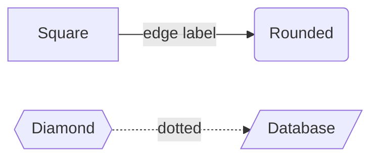
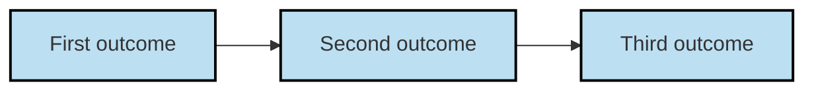

### Mermaid on GitHub and VSCode — Reference & Template

This guide collects:

* Common reasons a diagram refuses to render on GitHub
* A concise syntax cheat‑sheet
* A template

---

#### 0 — Common Rendering Errors

| Problem | Explanation | Fix |
|---------|-------------|-----|
| **Missing fenced `mermaid` code‑block** | GitHub only invokes Mermaid when the diagram lives inside a fenced block labelled `mermaid`. Pasting raw code leaves it as plain text. | Wrap the diagram in:<br>\`\`\`mermaid\`<br>*your code*<br>\`\`\`\`
| **Semicolon after `graph LR`** | GitHub’s Mermaid build is strict; omitting the terminator sometimes triggers “syntax error”. | End the declaration with a `;`.
| **Underscores in sub‑graph names** | Older Mermaid versions choke on unquoted underscores. | Quote the title or remove underscores: `subgraph "Final Outcomes"`.
| **Class shorthand `:::className`** | Older versions lack the shorthand; rendering fails. | Use the long form: `class node1,node2 className`.
| **Large raw file (> 2 MB)** | GitHub times out and displays nothing. | Split the diagram or slim the file.
| **Indenting the code fence** | A fenced block indented under a list or blockquote isn’t recognised. | Keep the opening \`\`\`\`\` flush with the margin.

---

#### 1 — Wrap it correctly

This is how every Mermaid diagram file you generate **must** be structured:
```markdown
\`\`\`mermaid
…your diagram code…
\`\`\`
```

---

#### 2 — Start with a valid declaration

```mermaid
graph LR;
```

Supported keywords: **graph**, **sequenceDiagram**, **classDiagram**, **stateDiagram-v2**, **erDiagram**, **gantt**, **journey**.
Always finish the line with `;`.

---

#### 3 — Flowchart nuts and bolts



| Syntax | Shape |
|--------|-------|
| `A[Text]`    | Rectangle |
| `B(Text)`    | Rounded rectangle |
| `C{{Text}}`  | Diamond |
| `D[/Text/]`  | Database (cylinder) |

Link styles: solid `-->`, dotted `-.->`, thick `==>`, labelled `-->|text|`.

---

#### 4 — Grouping & direction

```mermaid
subgraph "Phase 1"
    direction TB
    A --> B
end
```

* Directions: `LR` (left→right), `TB` (top→bottom), `RL`, `BT`.

---

#### 5 — Styling with classes

```mermaid
classDef important fill:#ffdba3,stroke:#d18500,stroke-width:2px;
class A,B,C important
```

Declare styles once with `classDef`, then assign with `class`.

---

#### 6 — Comments

Prefix a line with `%%` to ignore it:

```mermaid
%% This is a comment
```

---

#### 7 — Check GitHub’s Mermaid version

```mermaid
info
```

The rendered block shows the currently deployed version.

---

#### 8 — Quick template (copy‑paste)

