# Vision for modular component architecture
This diagram outlines a modular component architecture, illustrating the evolution and interconnection of various projects and platforms. The vision centers around the **PubMD ecosystem** and its integration with other specialized applications and data sources.

```mermaid
graph TD;
    subgraph "Core_Arch"
        Eve1["EVE 1.0"]
        BaseReact["Base React website"]
        SparxConv["SparxEA conversion functionality"]
        WikiPlat["Wiki platform"]

        PubmdLive["Pubmd Live"]
        RAGPlatform["RAG Platform"]
        DoViewAg["DoView Agent"]
        Eve2["EVE 2.0"]
        DoView["DoView"]
        ComplianceApp["Compliance Assistant"]

        subgraph "Pubmd components"
            PubmdCore["Pubmd (core)"]
            PubmdLite["Pubmd Lite"]
            PubmdCLI["Pubmd CLI"]
            
            subgraph PubmdW_container["Pubmd Wiki"]
                PubmdW["Pubmd Wiki"]
                subgraph "Modules"
                    RAGMod["RAG Module"]
                    SparxMod["SparxEA Module"]
                end
            end
        end

        Eve1 --> BaseReact
        Eve1 --> SparxConv

        BaseReact --> WikiPlat
        SparxConv --> SparxMod

        WikiPlat --> PubmdW
        PubmdCore --> PubmdW
        PubmdCore --> PubmdLite
        PubmdCore --> PubmdCLI
        
        PubmdW --> PubmdLive
        PubmdW --> Modules      
        
        Modules --> PubmdLive

        RAGMod --> RAGPlatform
        SparxMod --> Eve2

        DoViewAg --> DoView
        RAGPlatform --> DoView
        RAGPlatform --> ComplianceApp

        Marama --> RAGMod
        Marama --> FamilyHistory
        FamilyTree <--> FamilyHistory
    end

    subgraph "Key"
        direction LR
        Done["Done / little work required"]
        Priority1["Priority 1 - leading"]
        Priority2["Priority 2 - leading/supporting"]
        Priority3["Priority 3 - supporting"]
    end

    subgraph "Related Projects"
        Marama["Marama"]
        FamilyTree["Family Tree"]
        FamilyHistory["Family History"]
    end

    %% Styling
    style Key fill:#000000
    style Core_Arch fill:#000000
    
    style Priority1 fill:#0fa044,stroke:#333,stroke-width:2px,color:#333
    style Priority2 fill:#0f83a0,stroke:#333,stroke-width:2px,color:#333
    style Priority3 fill:#a0960f,stroke:#333,stroke-width:2px,color:#333

    style PubmdCore fill:#0fa044,stroke:#333,stroke-width:2px,color:#333
    style PubmdLite fill:#0f83a0,stroke:#333,stroke-width:2px,color:#333
    style PubmdCLI fill:#0f83a0,stroke:#333,stroke-width:2px,color:#333
    style PubmdW fill:#0fa044,stroke:#333,stroke-width:2px,color:#333
    style RAGMod fill:#0fa044,stroke:#333,stroke-width:2px,color:#333
    style DoView fill:#0f83a0,stroke:#333,stroke-width:2px,color:#333
    style Eve2 fill:#0f83a0,stroke:#333,stroke-width:2px,color:#333
    style ComplianceApp fill:#0fa044,stroke:#333,stroke-width:2px,color:#333
    style FamilyHistory fill:#0f83a0,stroke:#333,stroke-width:2px,color:#333
    style FamilyTree fill:#a0960f,stroke:#333,stroke-width:2px,color:#333
    style Marama fill:#a0960f,stroke:#333,stroke-width:2px,color:#333
```

## Outline

**Core Evolution and PubMD:**
*   The architecture originates from `EVE 1.0` a.k.a. *Enterprise View Explorer*, which provided foundational elements like a `Base React website` and `SparxEA conversion functionality`.
*   These initial components transition into more robust platforms: the `Base React website` evolves into a `Wiki platform`, which in turn forms the basis for `Pubmd Wiki`. The `SparxEA conversion functionality` feeds into a dedicated `SparxEA Module`.
*   The **PubMD components** are central to this vision. `Pubmd (core)` is a high-priority (Priority 1) foundational block that underpins `Pubmd Wiki` (also Priority 1), `Pubmd Lite` (Priority 2), and `Pubmd CLI` (Priority 2).
*   `Pubmd Wiki` is a key platform, hosting `Modules` such as the `RAG Module` (Priority 1) and the `SparxEA Module`. Both the wiki and its modules contribute to `Pubmd Live`.

**Key Application Streams:**
1.  **RAG-Powered Applications:**
    *   The `RAG Module` is a critical component that feeds into a `RAG Platform`.
    *   This `RAG Platform` serves as a backbone for several applications:
        *   `Compliance Assistant`: A high-priority (Priority 1) application.
        *   `DoView`: A Priority 2 application, also supported by a `DoView Agent`.
2.  **EVE 2.0 and Specialized Tools:**
    *   The `SparxEA Module` (derived from `EVE 1.0`'s conversion functionality) contributes to the development of `EVE 2.0` (Priority 2).
3.  **Personal Knowledge & Domain-Specific Data:**
    *   `Marama` (Priority 3) is a supporting component that integrates with the `RAG Module` and `Family History` (Priority 2).
    *   `Family Tree` (Priority 3) has a close, bidirectional relationship with `Family History`, suggesting a system for managing genealogical or related historical data.
  
## Roadmap

**Overall Trajectory and Priorities:**
The vision depicts a strategic progression from earlier, more monolithic components towards a highly modular and interconnected system. The styling indicates a clear prioritization:
*   **Priority 1 (Green):** Focuses on establishing the core `Pubmd (core)` and `Pubmd Wiki` infrastructure, along with the `RAG Module` and the `Compliance Assistant` application. This suggests that content management, retrieval-augmented generation, and compliance are immediate key objectives.
*   **Priority 2 (Blue):** Includes extensions of PubMD (`Pubmd Lite`, `Pubmd CLI`), the `DoView` application, the next-generation `EVE 2.0`, and `Family History`. These are important follow-on or supporting developments.
*   **Priority 3 (Yellow):** Components like `Marama` and `Family Tree` are currently designated as supporting elements, likely providing data or specialized functionality to the higher-priority systems.

In essence, the architecture aims to create a robust, extensible platform leveraging PubMD's core capabilities and RAG technology to power a diverse set of tools and applications, ranging from live documentation and compliance assistance to specialized data management and the evolution of the EVE platform.
